# Spécifications Fonctionnelles Détaillées — Sentinel Nudge v1
## Phase P2 — Analyste métier

**Projet :** Sentinel Nudge
**Version :** 1.0
**Date de production :** 2026-04-11
**Statut :** En cours de rédaction
**Commanditaire :** Antony (RSSI)
**Niveau de sensibilité :** Exposé
**Document de référence :** p1-cahier-des-charges-v1.1.md
**Comité de sécurité pré-P2 :** Tenu le 2026-04-11 (cf. gouvernance-pv-securite-p2-v1.0.md)

---

## Table des matières

1. Introduction
2. Spécifications par module
   - 2.1 M2 — Détection de saisie en contexte risqué
   - 2.2 M3 — Score de cyber-hygiène hebdomadaire
   - 2.3 M5 — Rappel de mise à jour navigateur
   - 2.4 M6 — Mini-quiz phishing contextuel
   - 2.5 M7 — Nudge d'adoption gestionnaire de mots de passe
   - 2.6 M9 — Indicateur de force du mot de passe
   - 2.7 M17 — Alerte au copier-coller de données sensibles
3. Composants transversaux
   - 3.1 Système de quota journalier
   - 3.2 Stockage local (IndexedDB + chrome.storage.local)
   - 3.3 Onboarding — Premier lancement
   - 3.4 Page de paramètres
   - 3.5 Dashboard — Tableau de bord
   - 3.6 Système de notification
   - 3.7 Pages d'explication statiques
4. Exigences non fonctionnelles détaillées
   - 4.1 Privacy by design — mapping par module
   - 4.2 Performance — budget par module
   - 4.3 Accessibilité — checklist WCAG 2.1 AA par composant UI
   - 4.4 Internationalisation — structure i18n
   - 4.5 Sécurité — décisions du comité de sécurité
5. Matrice de traçabilité CdC → SFD
6. Glossaire

---

## 1. Introduction

Ce document détaille les spécifications fonctionnelles de Sentinel Nudge v1, en complément du cahier des charges v1.1. Il fournit pour chaque module et composant transversal :
- Les diagrammes de séquence et machines à états (Mermaid)
- Les dictionnaires de données complets
- Les cas limites et la gestion d'erreurs
- Les interactions inter-modules
- Les critères d'acceptation enrichis (Gherkin)

Les décisions du comité de sécurité pré-P2 (D-SEC-001 à D-SEC-005) sont intégrées dans chaque section concernée.

---

## 2. Spécifications par module

### 2.1 M2 — Détection de saisie en contexte risqué

#### 2.1.1 Diagramme de séquence

```mermaid
sequenceDiagram
    participant U as Utilisateur
    participant CS as Content Script
    participant SW as Service Worker
    participant ST as Stockage Local
    participant UI as Overlay M2

    U->>CS: Focus sur <input type="password">
    CS->>CS: Détecter les signaux de risque
    Note over CS: 1. Schéma HTTP?<br/>2. Hors HSTS preload?<br/>3. Typosquatting (Levenshtein)?<br/>4. Cert auto-signé?
    CS->>SW: sendMessage({module: 'M2', signals: [...], domain_hash})
    SW->>ST: Lire whitelist + quota + session M2
    ST-->>SW: {whitelist, quota_count, session_domains}

    alt Domaine dans whitelist
        SW-->>CS: {action: 'skip', reason: 'whitelisted'}
    else Moins de 2 signaux
        SW-->>CS: {action: 'skip', reason: 'insufficient_signals'}
    else Déjà nudgé cette session pour ce domaine
        SW-->>CS: {action: 'skip', reason: 'session_duplicate'}
    else Quota atteint ET M2 non critique
        SW-->>CS: {action: 'skip', reason: 'quota_reached'}
        SW->>ST: Enregistrer événement silencieux (pour M3)
    else Conditions remplies
        SW->>ST: Incrémenter quota
        SW->>ST: Enregistrer domaine dans session M2
        SW-->>CS: {action: 'show', signals: [...]}
        CS->>UI: Afficher overlay M2
        U->>UI: Action utilisateur

        alt Continuer quand même
            UI->>CS: fermer overlay
            CS->>SW: {action: 'dismissed'}
            SW->>ST: Enregistrer événement (action: 'dismissed')
        else Marquer comme de confiance
            UI->>CS: fermer overlay
            CS->>SW: {action: 'trusted', domain_hash}
            SW->>ST: Ajouter à whitelist
            SW->>ST: Enregistrer événement (action: 'trusted')
        else Abandonner la saisie
            UI->>CS: fermer overlay + focus barre d'adresse
            CS->>SW: {action: 'abandoned'}
            SW->>ST: Enregistrer événement (action: 'abandoned')
        else Pourquoi ce message ?
            UI->>UI: Afficher explication inline (signaux détectés + source scientifique)
        end
    end
```

#### 2.1.2 Machine à états du nudge M2

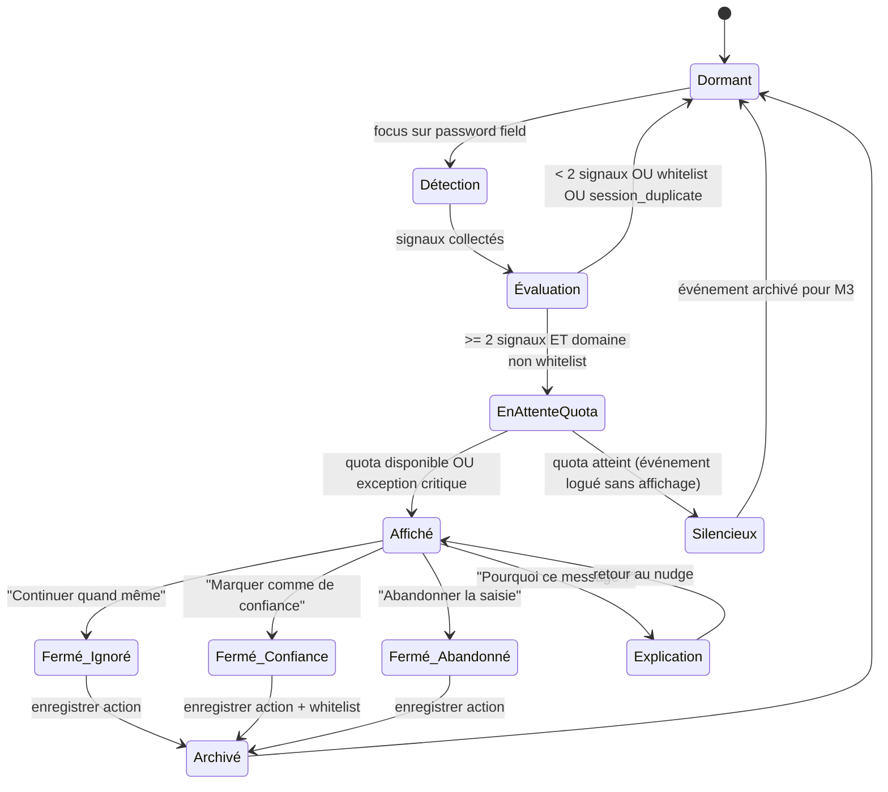

#### 2.1.3 Dictionnaire de données

**Données d'entrée :**

| Champ | Type | Source | Description | Contrainte |
|-------|------|--------|-------------|-----------|
| `current_url` | string | `chrome.tabs` API | URL complète de l'onglet actif | Jamais stockée en clair |
| `url_scheme` | enum('http','https') | Extraction de `current_url` | Schéma de la page | — |
| `domain` | string | Extraction de `current_url` | Domaine de la page courante | Hashé avant tout stockage |
| `domain_hash` | string(64) | SHA-256(`domain`) | Empreinte du domaine | Stocké, jamais le domaine |
| `is_hsts` | boolean | Lookup dans HSTS preload list embarquée | Domaine dans la HSTS preload list | Liste mise à jour via Chrome Web Store |
| `levenshtein_score` | integer | Algorithme Levenshtein vs liste cibles | Distance typographique minimale avec un domaine connu | Seuil : distance ≤ 2 = suspect |
| `is_self_signed` | boolean | `chrome.tabs` security state | Certificat TLS auto-signé | API MV3 à valider en P3 |
| `password_field_focused` | boolean | DOM `focus` event listener | Un champ password a le focus | Content script `document_idle` |

**Données de sortie :**

| Champ | Type | Destination | Description | Rétention |
|-------|------|-------------|-------------|-----------|
| `event_id` | auto-increment | IndexedDB `events` | Identifiant unique de l'événement | 90 jours |
| `module` | string('M2') | IndexedDB `events` | Identifiant du module source | 90 jours |
| `timestamp` | ISO 8601 | IndexedDB `events` | Date/heure de l'événement | 90 jours |
| `domain_hash` | string(64) | IndexedDB `events` | Hash SHA-256 du domaine | 90 jours |
| `signals` | string[] | IndexedDB `events` | Liste des signaux détectés (ex: ['http','typosquatting']) | 90 jours |
| `action_user` | enum | IndexedDB `events` | Action de l'utilisateur : 'dismissed', 'trusted', 'abandoned', 'silent' | 90 jours |
| `quota_increment` | integer(1) | chrome.storage.local | Incrément du compteur de quota journalier | Réinitialisé à minuit |

#### 2.1.4 Cas limites et gestion d'erreurs

| Cas | Comportement attendu | Justification |
|-----|---------------------|---------------|
| Page en HTTPS mais cert auto-signé + typosquatting | Nudge affiché (2 signaux atteints) | Cumul de signaux faibles = risque élevé |
| Formulaire de connexion sur HTTP en localhost (127.0.0.1) | Pas de nudge | Localhost est exclu (développement local légitime) |
| Domaine contenant un caractère Unicode (IDN homograph) | Traiter comme signal de typosquatting | Attaque connue (punycode) |
| Whitelist corrompue (format invalide en IndexedDB) | Recréer la whitelist vide, logger l'erreur | Fail-safe : en cas de doute, protéger l'utilisateur |
| HSTS preload list non chargée (fichier absent du bundle) | Ne pas utiliser ce signal, continuer avec les 3 autres | Dégradation gracieuse |
| Utilisateur désactive M2 dans les paramètres | Aucune détection, aucun nudge, aucun événement logué | Module complètement inactif |
| Champ password dans une iframe cross-origin | Ne pas détecter (limitation MV3 : content script = même origin) | Documenter la limitation |

#### 2.1.5 Interactions inter-modules détaillées

| Interaction | Description | Priorité |
|-------------|-------------|----------|
| M2 → M3 | Chaque événement M2 (affiché ou silencieux) alimente la composante "Comportement sur sites risqués". Action 'dismissed' = -4 pts, 'abandoned' = neutre, 'trusted' = neutre, 'silent' = -4 pts | — |
| M2 vs M7 | Si M2 et M7 se déclenchent sur le même formulaire : M2 est prioritaire (overlay interstitiel). M7 (toast) est différé de 5s après la fermeture de M2. | M2 > M7 |
| M2 vs M9 | M2 sur formulaire de connexion = M9 ne s'active pas (M9 = création uniquement). Pas de conflit. | Pas de conflit |
| M2 vs Quota | M2 est événementiel critique : affiché même si quota atteint (exception). Incrémente le compteur au-delà du quota. | Exception |

#### 2.1.6 Critères d'acceptation enrichis

Les CA-M2-01 à CA-M2-06 du CdC v1.1 sont repris et complétés :

**CA-M2-07 — Exclusion de localhost**
```gherkin
Given l'utilisateur navigue sur http://127.0.0.1:8080 avec un champ password
When l'utilisateur place le focus dans le champ password
Then aucun nudge M2 ne s'affiche
```

**CA-M2-08 — IDN homograph (punycode)**
```gherkin
Given l'utilisateur navigue sur "xn--pypal-4ve.com" (homograph de paypal.com)
  And la page contient un champ password
  And au moins 1 autre signal de risque est présent
When l'utilisateur place le focus dans le champ password
Then le nudge M2 s'affiche avec le signal "typosquatting" dans l'explication
```

**CA-M2-09 — Dégradation gracieuse HSTS**
```gherkin
Given la HSTS preload list n'est pas chargeable (fichier corrompu)
When un événement M2 est évalué
Then le signal HSTS est ignoré
  And les 3 autres signaux sont évalués normalement
  And un log d'erreur est enregistré dans la console de l'extension
```

**CA-M2-10 — Coexistence M2 + M7**
```gherkin
Given l'utilisateur saisit un mot de passe réutilisé sur un site à risque
When M2 et M7 se déclenchent simultanément
Then M2 (overlay interstitiel) s'affiche en priorité
  And M7 (toast) s'affiche 5 secondes après la fermeture de M2
  And les deux événements sont comptabilisés dans le quota
```

**CA-M2-11 — Sécurité DOM (D-SEC-003)**
```gherkin
Given le nudge M2 est affiché
When le contenu du domaine est injecté dans l'overlay
Then le domaine est affiché via textContent (jamais innerHTML)
  And aucun contenu de la page hôte n'est injecté dans l'overlay sans sanitization
```

---

### 2.2 M3 — Score de cyber-hygiène hebdomadaire

#### 2.2.1 Diagramme de séquence

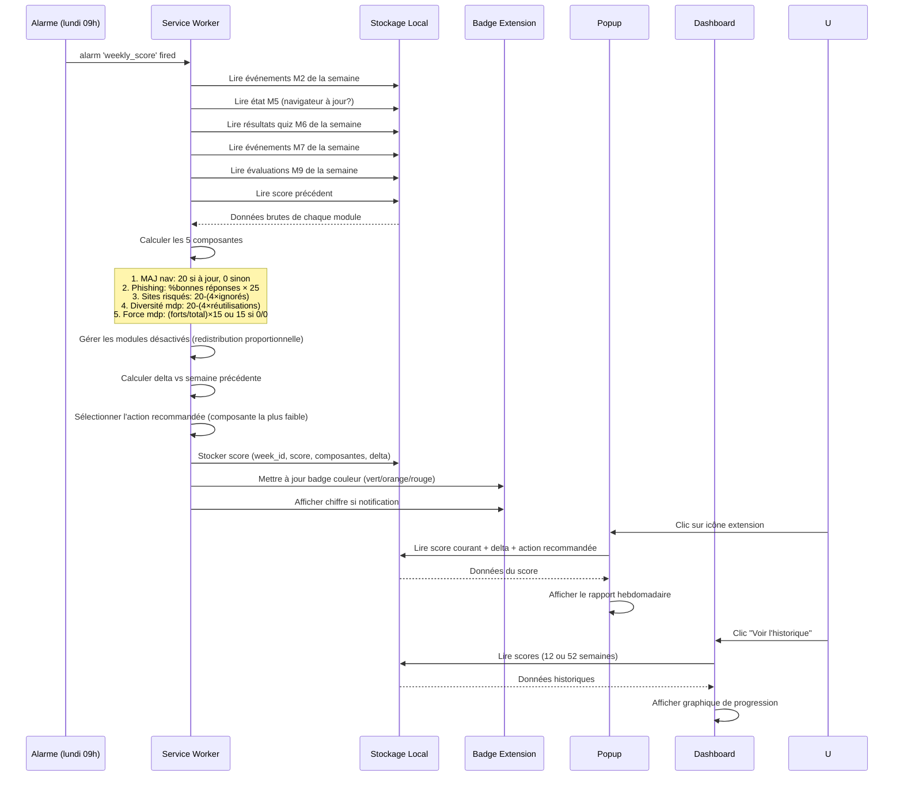

#### 2.2.2 Machine à états du score

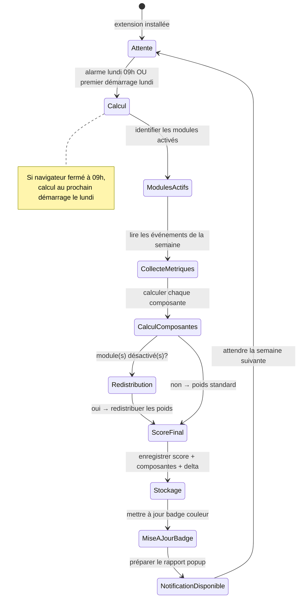

#### 2.2.3 Dictionnaire de données

**Données d'entrée (agrégées depuis les modules) :**

| Composante | Source | Requête IndexedDB | Calcul |
|-----------|--------|-------------------|--------|
| MAJ navigateur | M5 | Dernier événement M5 de la semaine | `is_up_to_date ? 20 : 0` |
| Résistance phishing | M6 | Derniers résultats quiz (`quiz_history` WHERE `timestamp` >= lundi précédent) | `(sum(correct) / sum(total)) × 25`. Si aucun quiz cette semaine : reprendre le dernier score connu |
| Comportement sites risqués | M2 | `events` WHERE `module='M2'` AND `action_user='dismissed'` AND `timestamp` >= lundi | `max(0, 20 - (4 × count(dismissed)))` |
| Diversité mots de passe | M7 | `events` WHERE `module='M7'` AND nudge affiché AND `timestamp` >= lundi | `max(0, 20 - (4 × count(reuse_detected)))` |
| Force mots de passe | M9 | `events` WHERE `module='M9'` AND `timestamp` >= lundi | Si 0 créations : `15` (indicateur 0/0). Sinon : `(count(force >= 4) / count(total)) × 15` (indicateur X/Y) |

**Données de sortie :**

| Champ | Type | Destination | Rétention |
|-------|------|-------------|-----------|
| `week_id` | string('YYYY-Www') | IndexedDB `scores` | 52 semaines |
| `score` | integer(0-100) | IndexedDB `scores` | 52 semaines |
| `composantes` | object | IndexedDB `scores` | 52 semaines |
| `delta` | integer(-100..+100) | IndexedDB `scores` | 52 semaines |
| `action_recommandee` | string | IndexedDB `scores` | 52 semaines |
| `badge_color` | enum('green','orange','red') | Badge extension | Jusqu'au prochain calcul |

**Algorithme de redistribution des poids :**

```
Si module M désactivé :
  poids_redistribué = poids_M × (poids_module_actif / somme_poids_actifs)
  Appliquer à chaque module actif

Exemple : M6 désactivé (25 pts)
  Actifs : M5(20) + M2(20) + M7(20) + M9(15) = 75
  M5 reçoit : 20 + 25×(20/75) = 26.67
  M2 reçoit : 20 + 25×(20/75) = 26.67
  M7 reçoit : 20 + 25×(20/75) = 26.67
  M9 reçoit : 15 + 25×(15/75) = 20.00
  Total = 100 ✓
```

**Algorithme de sélection de l'action recommandée :**

```
Identifier la composante avec le plus grand écart relatif au maximum :
  ecart_relatif = (poids_max - score_composante) / poids_max

Si ecart_relatif >= 0.5 :
  Recommander l'action corrective de cette composante
Sinon :
  Recommander "Continuez ainsi !" (message de renforcement positif)

Actions correctives par composante :
  MAJ nav → "Mettez à jour votre navigateur pour corriger les failles de sécurité"
  Phishing → "Un quiz phishing est disponible — testez votre vigilance"
  Sites risqués → "Soyez attentif aux alertes sur les sites suspects"
  Diversité mdp → "Diversifiez vos mots de passe avec un gestionnaire"
  Force mdp → "Renforcez vos mots de passe lors de vos prochaines inscriptions"
```

#### 2.2.4 Cas limites et gestion d'erreurs

| Cas | Comportement attendu |
|-----|---------------------|
| Première semaine (pas de score précédent) | Delta = 0, message "Votre premier score !" |
| Tous les modules désactivés sauf M3 | Score = 0/0, message "Activez au moins un module pour obtenir un score" |
| M3 lui-même désactivé | Aucun calcul, aucun badge, aucun rapport |
| Navigateur fermé le lundi | Calcul au premier démarrage le lundi. Si démarrage mardi, calcul immédiat mais semaine de référence = lundi-dimanche précédent |
| IndexedDB corrompue (store `events` inaccessible) | Score = "Données indisponibles", proposer "Effacer et recommencer" |
| Score = 0 | Message empathique : "Ce score est un point de départ — chaque semaine compte" |

#### 2.2.5 Critères d'acceptation enrichis

**CA-M3-06 — Première semaine d'utilisation**
```gherkin
Given l'extension est installée depuis moins de 7 jours
When le premier lundi est atteint
Then le score est calculé sur les jours disponibles
  And le delta affiche "Premier score !"
  And aucune comparaison semaine/semaine n'est affichée
```

**CA-M3-07 — Redistribution avec 2 modules désactivés**
```gherkin
Given l'utilisateur a désactivé M6 (25 pts) et M9 (15 pts)
When le score est calculé
Then les 40 points sont redistribués proportionnellement entre M5 (20), M2 (20), M7 (20)
  And le score total est exprimé sur 100
  And le détail affiche uniquement les 3 modules actifs
```

**CA-M3-08 — Action recommandée sur la composante la plus faible**
```gherkin
Given le score de la composante "Diversité mots de passe" est 4/20
  And toutes les autres composantes sont au-dessus de 50%
When le rapport hebdomadaire est affiché
Then l'action recommandée concerne la diversité des mots de passe
  And un lien "Voir comment faire" renvoie vers la page d'explication M7
```

---

### 2.3 M5 — Rappel de mise à jour navigateur

#### 2.3.1 Diagramme de séquence

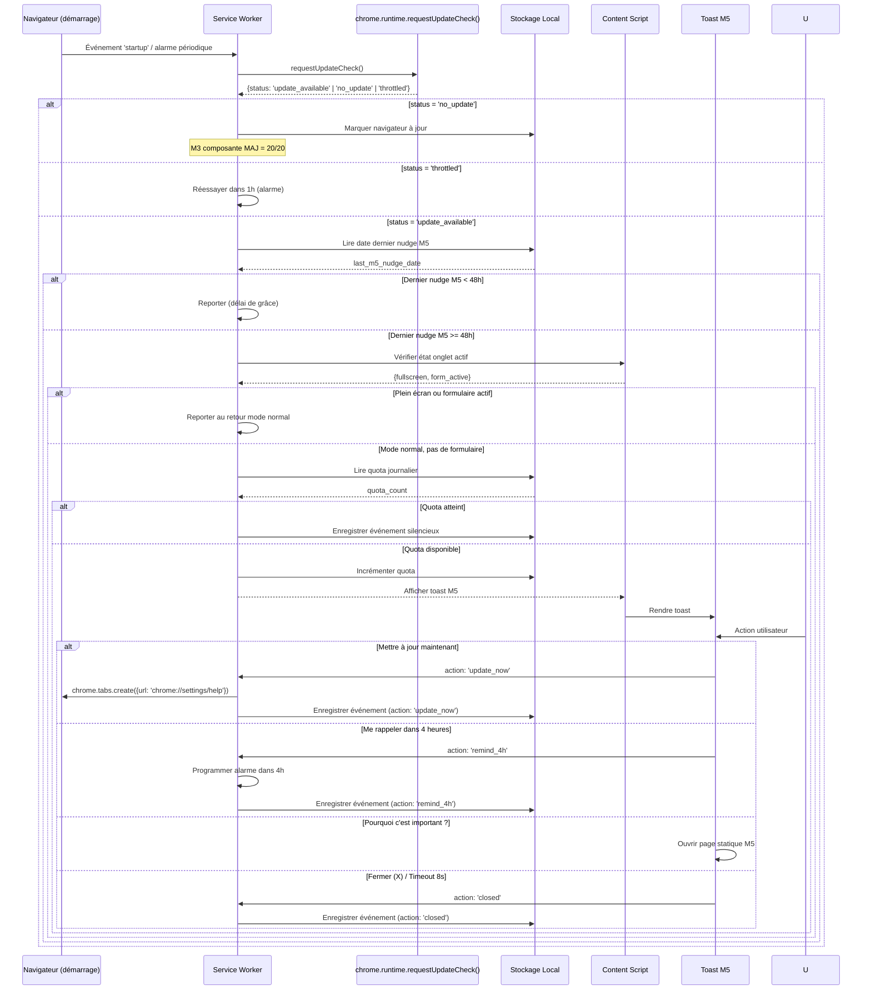

#### 2.3.2 Machine à états

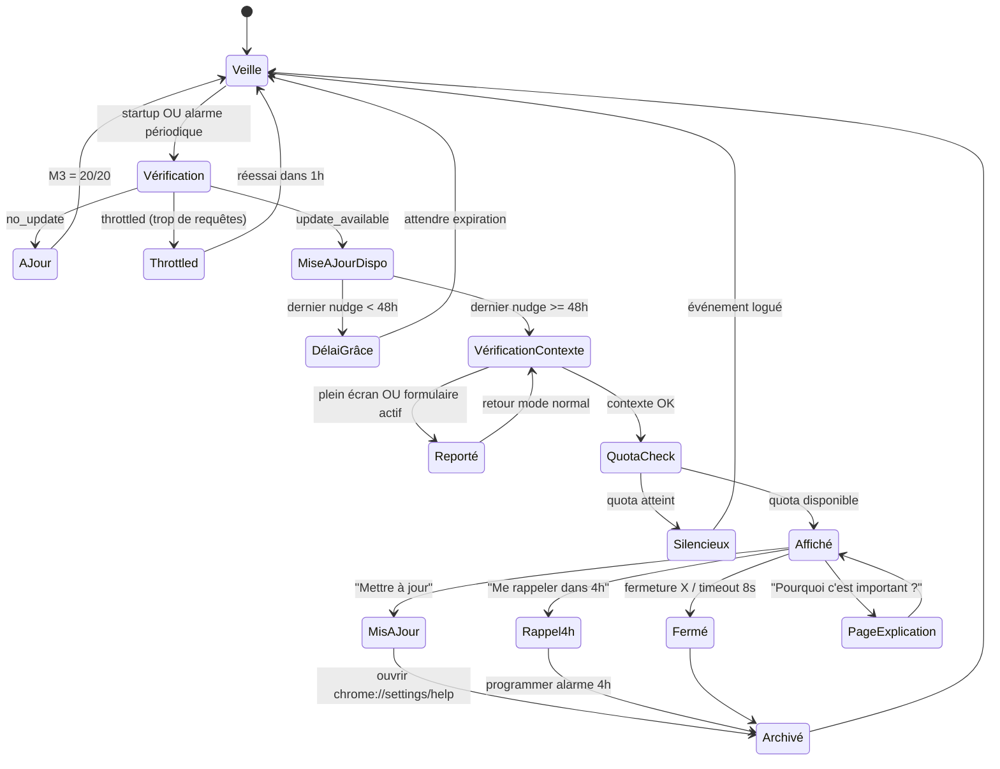

#### 2.3.3 Dictionnaire de données

**Données d'entrée :**

| Champ | Type | Source | Description |
|-------|------|--------|-------------|
| `update_status` | enum('update_available','no_update','throttled') | `chrome.runtime.requestUpdateCheck()` | État de mise à jour du navigateur |
| `current_version` | string | `navigator.userAgentData.brands` ou User-Agent | Version courante du navigateur |
| `last_m5_nudge` | ISO 8601 | chrome.storage.local | Date/heure du dernier nudge M5 |
| `is_fullscreen` | boolean | Content script / `document.fullscreenElement` | Navigateur en plein écran |
| `is_form_active` | boolean | Content script / `document.activeElement.tagName` | Un formulaire a le focus |

**Données de sortie :**

| Champ | Type | Destination | Rétention |
|-------|------|-------------|-----------|
| `event_id` | auto-increment | IndexedDB `events` | 90 jours |
| `module` | string('M5') | IndexedDB `events` | 90 jours |
| `timestamp` | ISO 8601 | IndexedDB `events` | 90 jours |
| `version_detected` | string | IndexedDB `events` | 90 jours |
| `action_user` | enum('update_now','remind_4h','closed','silent') | IndexedDB `events` | 90 jours |

#### 2.3.4 Cas limites et gestion d'erreurs

| Cas | Comportement attendu |
|-----|---------------------|
| `requestUpdateCheck()` retourne 'throttled' | Réessayer dans 1h via alarme. Ne pas afficher de nudge. |
| API `requestUpdateCheck()` non disponible (navigateur modifié) | Dégradation gracieuse : M5 désactivé, composante M3 = 0/20, log d'erreur |
| Utilisateur clique "Mettre à jour" mais `chrome://settings/help` est bloqué | Afficher message alternatif : "Ouvrez manuellement chrome://settings/help" |
| Navigateur sort du plein écran pendant le délai de report | Revérifier et afficher le nudge si les conditions sont toujours remplies |
| 4 clics consécutifs sur "Me rappeler dans 4h" (16h de report) | Après le 3e report consécutif : passer le délai de grâce à 48h (retour au rythme normal) |

#### 2.3.5 Critères d'acceptation enrichis

**CA-M5-05 — Gestion du throttling**
```gherkin
Given chrome.runtime.requestUpdateCheck() retourne "throttled"
When l'événement est traité
Then aucun nudge M5 ne s'affiche
  And une alarme est programmée pour réessayer dans 1 heure
```

**CA-M5-06 — Report maximum (anti-snooze infini)**
```gherkin
Given l'utilisateur a cliqué 3 fois de suite sur "Me rappeler dans 4 heures"
When le nudge M5 se représente une 4e fois
Then le bouton "Me rappeler dans 4 heures" n'est plus proposé
  And les options restantes sont "Mettre à jour" et "Fermer"
  And le prochain nudge M5 suivra le délai de grâce standard de 48h
```

---

### 2.4 M6 — Mini-quiz phishing contextuel

#### 2.4.1 Diagramme de séquence

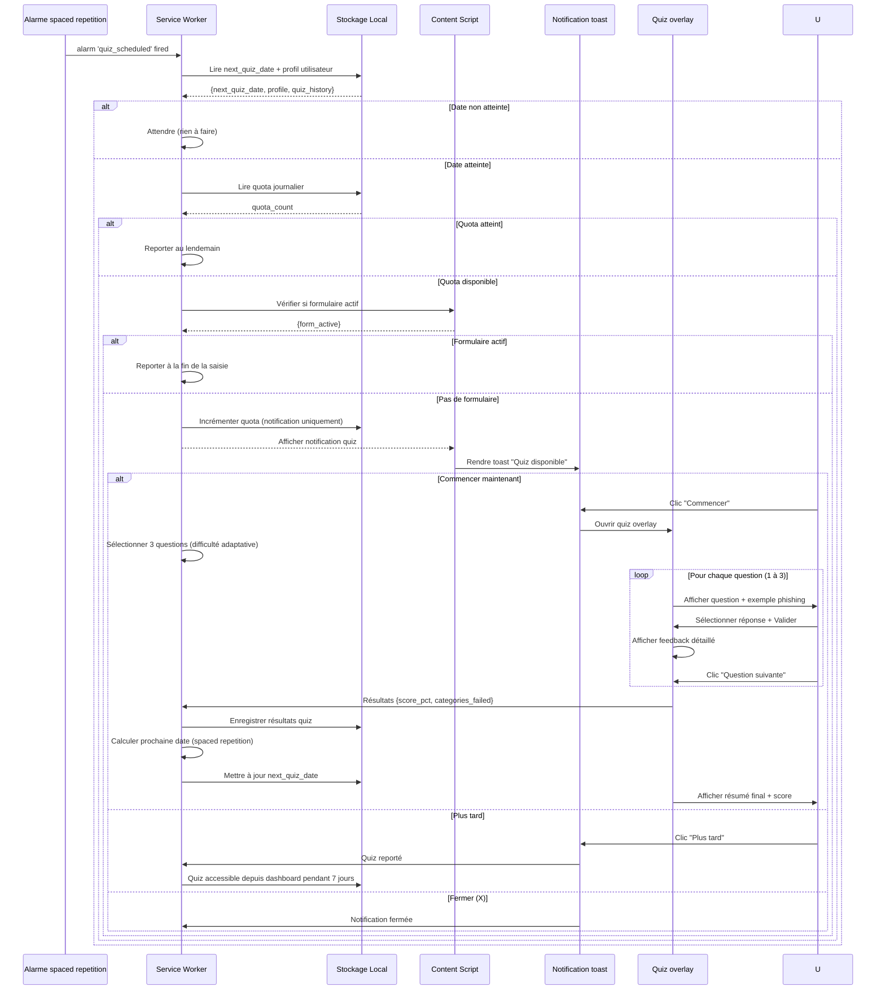

#### 2.4.2 Machine à états

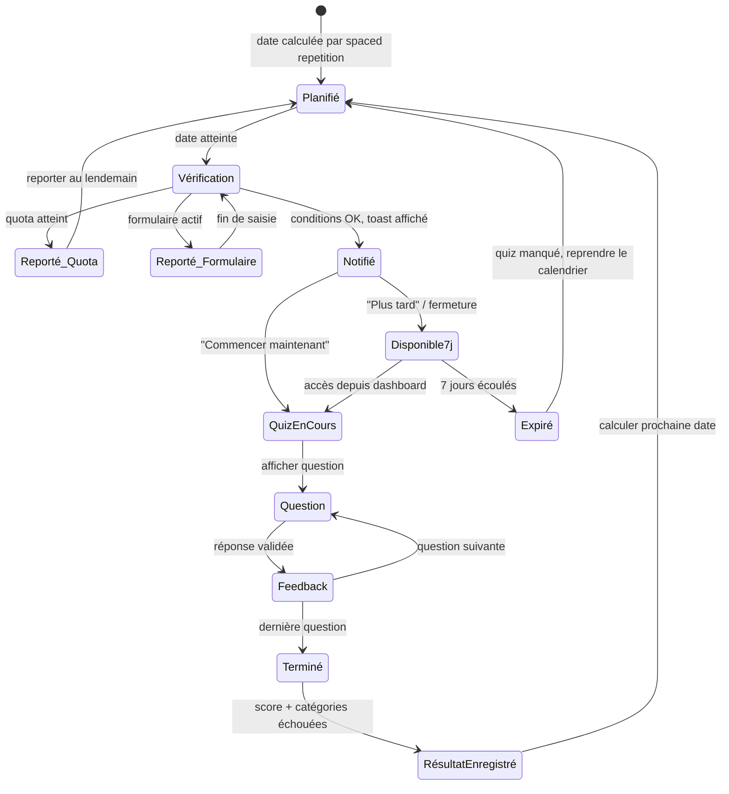

#### 2.4.3 Dictionnaire de données

**Corpus quiz (embarqué) :**

| Champ | Type | Description |
|-------|------|-------------|
| `quiz_id` | string | Identifiant unique de l'exemple (ex: "phish-042") |
| `category` | enum('urgency','authority','gain','threat') | Technique de phishing utilisée |
| `difficulty` | enum('basic','intermediate','expert') | Niveau de difficulté |
| `locale` | enum('fr','en') | Langue de l'exemple |
| `type` | enum('email','webpage','sms') | Type de contenu simulé |
| `content` | object | Contenu de l'exemple (sujet, expéditeur, corps, URL) |
| `is_phishing` | boolean | Réponse correcte |
| `indicators` | string[] | Liste des signaux de phishing présents |
| `explanation` | string | Feedback détaillé |

**Algorithme de sélection adaptatif :**

```
1. Filtrer par locale courante
2. Filtrer par difficulté selon le profil :
   - Débutant : basic + intermediate
   - Intermédiaire : basic + intermediate + expert (pondéré)
   - Avancé : intermediate + expert
3. Si score des 2 derniers quiz = 100% : augmenter la difficulté d'un cran
4. Prioriser les catégories échouées précédemment
5. Exclure les quiz déjà vus dans les 3 dernières sessions
6. Sélectionner 3 questions (mix phishing / légitime : 2 phishing + 1 légitime)
```

**Données de sortie :**

| Champ | Type | Destination | Rétention |
|-------|------|-------------|-----------|
| `quiz_session_id` | auto-increment | IndexedDB `quiz_history` | Illimité |
| `timestamp` | ISO 8601 | IndexedDB `quiz_history` | Illimité |
| `score_pct` | integer(0-100) | IndexedDB `quiz_history` | Illimité |
| `questions_ids` | string[] | IndexedDB `quiz_history` | Illimité |
| `categories_failed` | string[] | IndexedDB `quiz_history` | Illimité |
| `next_quiz_date` | ISO 8601 | chrome.storage.local | Jusqu'au prochain quiz |

**Calendrier spaced repetition — algorithme :**

```
base_intervals = [0, 7, 21, 42, 70]  // jours depuis installation
after_initial = 30  // mensuel après les 5 premières sessions

Si session_count < 5 :
  next_date = install_date + base_intervals[session_count]
Sinon :
  next_date = last_quiz_date + after_initial

Ajustement : si dernier score < 50% : réduire l'intervalle de 30%
            si dernier score = 100% : augmenter l'intervalle de 20%
```

#### 2.4.4 Cas limites et gestion d'erreurs

| Cas | Comportement attendu |
|-----|---------------------|
| Corpus vide ou fichier JSON corrompu | M6 désactivé, message "Quiz temporairement indisponible", log erreur |
| Utilisateur ne finit pas le quiz (ferme l'overlay en cours) | Sauvegarder les réponses données, marquer le quiz comme incomplet, reproposer au prochain démarrage |
| Tous les quiz du corpus ont déjà été vus | Recycler les plus anciens (vus il y a > 90 jours) |
| Utilisateur change de profil après un quiz | Appliquer le nouveau profil au prochain quiz |
| Quiz planifié pendant le week-end (navigateur fermé) | Reporter au lundi suivant (intégré au calcul M3) |

#### 2.4.5 Critères d'acceptation enrichis

**CA-M6-06 — Quiz incomplet**
```gherkin
Given l'utilisateur a répondu à 2 questions sur 3
When il ferme l'overlay du quiz
Then les 2 réponses sont sauvegardées
  And le quiz est marqué comme incomplet
  And il est reproposé au prochain démarrage du navigateur
```

**CA-M6-07 — Recyclage du corpus**
```gherkin
Given tous les 50 exemples du corpus ont été utilisés
When un nouveau quiz est généré
Then les exemples vus il y a plus de 90 jours sont réintégrés au pool
  And la sélection adaptative s'applique normalement
```

**CA-M6-08 — Ajustement spaced repetition par score**
```gherkin
Given l'utilisateur a obtenu 30% au dernier quiz
When la prochaine date est calculée
Then l'intervalle est réduit de 30% par rapport à l'intervalle standard
  And la prochaine date est enregistrée dans chrome.storage.local
```

---

### 2.5 M7 — Nudge d'adoption gestionnaire de mots de passe

#### 2.5.1 Diagramme de séquence

```mermaid
sequenceDiagram
    participant U as Utilisateur
    participant CS as Content Script
    participant SW as Service Worker
    participant ST as Stockage Local
    participant UI as Toast M7

    U->>CS: Submit formulaire avec <input type="password">
    CS->>CS: Capturer valeur password au submit
    CS->>CS: Calculer SHA-256(sel_local + valeur)
    Note over CS: D-SEC-001 : sel local obligatoire
    CS->>CS: Effacer valeur en clair de la mémoire
    CS->>SW: sendMessage({module: 'M7', hash, domain_hash})

    SW->>ST: Lire password_hashes + suppression_list + last_m7_nudge
    ST-->>SW: {hashes[], suppression_domains[], last_nudge_by_domain}

    SW->>ST: Stocker le hash (FIFO max 100)

    alt Hash déjà présent dans le store (réutilisation détectée)
        alt Domaine dans la liste de suppression
            SW->>SW: Pas de nudge (utilisateur a demandé "Ne plus afficher")
        else Dernier nudge M7 pour ce domaine < 30 jours
            SW->>SW: Pas de nudge (délai de grâce)
        else Conditions remplies
            SW->>ST: Lire quota
            alt Quota atteint
                SW->>ST: Enregistrer événement silencieux
            else Quota disponible
                SW->>ST: Incrémenter quota
                SW-->>CS: Afficher toast M7
                CS->>UI: Rendre toast

                alt Voir comment ça marche
                    U->>UI: Clic
                    UI->>SW: Ouvrir page statique gestionnaires mdp
                    SW->>ST: Enregistrer événement (action: 'learn_more')
                else OK, compris
                    U->>UI: Clic
                    UI->>SW: Fermer toast
                    SW->>ST: Enregistrer événement (action: 'acknowledged')
                else Ne plus afficher pour ce site
                    U->>UI: Clic
                    UI->>SW: Ajouter domaine à suppression_list
                    SW->>ST: Enregistrer suppression + événement
                end
            end
        end
    else Hash nouveau (pas de réutilisation)
        SW->>SW: Rien à signaler
    end
```

#### 2.5.2 Machine à états

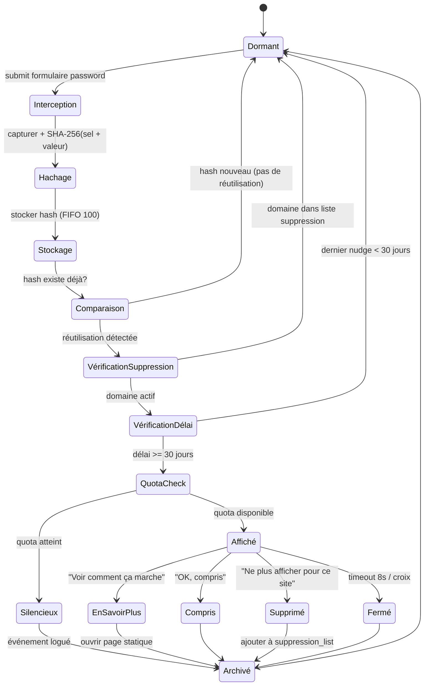

#### 2.5.3 Dictionnaire de données

**Données d'entrée :**

| Champ | Type | Source | Contrainte sécurité |
|-------|------|--------|-------------------|
| `password_value` | string | DOM `<input type="password">` au submit | **Jamais stocké** — effacé immédiatement après hachage |
| `installation_salt` | string(32) | chrome.storage.local (généré à l'installation) | D-SEC-001 : `crypto.getRandomValues(new Uint8Array(16))` |
| `password_hash` | string(64) | SHA-256(`installation_salt` + `password_value`) | Stocké dans IndexedDB `password_hashes` |
| `domain_hash` | string(64) | SHA-256(`domain`) | Stocké pour la suppression_list |

**Données de sortie :**

| Champ | Type | Destination | Rétention |
|-------|------|-------------|-----------|
| `hash` | string(64) | IndexedDB `password_hashes` | 90 jours FIFO max 100 |
| `timestamp` | ISO 8601 | IndexedDB `password_hashes` | 90 jours |
| `event` | object | IndexedDB `events` | 90 jours |
| `suppression_domain_hash` | string(64) | IndexedDB `whitelist` (module='M7') | Illimité (gestion manuelle) |

#### 2.5.4 Cas limites et gestion d'erreurs

| Cas | Comportement attendu |
|-----|---------------------|
| Formulaire soumis via JavaScript (pas de submit HTML) | Écouter aussi l'événement `XMLHttpRequest` / `fetch` sur les formulaires contenant un password field |
| Champ password vide au submit | Ignorer (pas de hachage d'une chaîne vide) |
| FIFO 100 hashes plein | Supprimer le plus ancien hash avant d'ajouter le nouveau |
| Sel d'installation perdu (chrome.storage.local effacé) | Générer un nouveau sel. Conséquence : les anciens hash ne matcheront plus → pas de faux positifs, mais réutilisations existantes non détectées. Acceptable. |
| Même mot de passe soumis 2x sur le même domaine | Pas de nudge (réutilisation = inter-domaines uniquement) |
| Extension installée après la création du mot de passe (hash pas encore en base) | Pas de détection possible. Le hash sera collecté au prochain login. |

#### 2.5.5 Critères d'acceptation enrichis

**CA-M7-05 — Sel local obligatoire (D-SEC-001)**
```gherkin
Given l'extension est installée
When un mot de passe est intercepté pour hachage
Then le hash est calculé avec SHA-256(sel_installation + mot_de_passe)
  And le sel est lu depuis chrome.storage.local
  And si le sel n'existe pas, un nouveau sel est généré avant le hachage
```

**CA-M7-06 — FIFO 100 hashes**
```gherkin
Given 100 hashes sont déjà stockés dans IndexedDB
When un 101e hash est ajouté
Then le hash le plus ancien est supprimé
  And le nouveau hash est ajouté
  And le store contient exactement 100 hashes
```

**CA-M7-07 — Réutilisation intra-domaine ignorée**
```gherkin
Given l'utilisateur soumet le même mot de passe 2 fois sur "site-a.com"
When le hash est comparé
Then aucun nudge M7 ne s'affiche (réutilisation intra-domaine)
```

---

### 2.6 M9 — Indicateur de force du mot de passe

#### 2.6.1 Diagramme de séquence

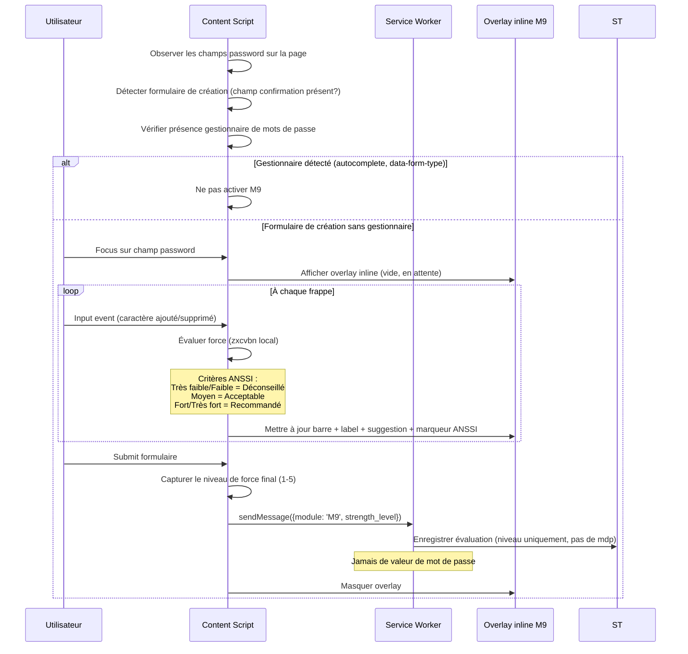

#### 2.6.2 Dictionnaire de données

**Données d'entrée :**

| Champ | Type | Source | Contrainte |
|-------|------|--------|-----------|
| `password_value` | string | DOM input event (temps réel) | **Jamais stocké, jamais transmis** — traitement en mémoire content script uniquement |
| `has_confirmation_field` | boolean | DOM scan | Signal de formulaire de création |
| `has_password_manager` | boolean | DOM attributs (`autocomplete`, `data-form-type`) | Détection heuristique |

**Algorithme zxcvbn — mapping vers niveaux ANSSI :**

| Score zxcvbn | Niveau | Label | Couleur | Marqueur ANSSI | Contribution M3 |
|-------------|--------|-------|---------|----------------|----------------|
| 0 | Très faible | "Très faible" | Rouge | "Déconseillé par l'ANSSI" | Non comptabilisé comme "fort" |
| 1 | Faible | "Faible" | Rouge | "Déconseillé par l'ANSSI" | Non comptabilisé comme "fort" |
| 2 | Moyen | "Moyen" | Jaune | "Acceptable" | Non comptabilisé comme "fort" |
| 3 | Fort | "Fort" | Vert clair | "Recommandé" | Comptabilisé comme "fort" |
| 4 | Très fort | "Très fort" | Vert foncé | "Recommandé" | Comptabilisé comme "fort" |

**Suggestions textuelles dynamiques :**

| Condition | Suggestion |
|-----------|-----------|
| Longueur < 12 | "Ajoutez des caractères — visez au moins 12" |
| Pas de chiffre | "Ajoutez un chiffre pour renforcer la force" |
| Pas de symbole ET longueur >= 12 | "Ajoutez un caractère spécial (@, #, !) pour passer à Fort" |
| Pattern détecté (123, abc, azerty) | "Évitez les séquences prévisibles" |
| Score = 4 | "Excellent ! Ce mot de passe est très solide" |

#### 2.6.3 Cas limites et gestion d'erreurs

| Cas | Comportement attendu |
|-----|---------------------|
| Champ password sans champ de confirmation mais avec `autocomplete="new-password"` | Considérer comme formulaire de création (activer M9) |
| Gestionnaire détecté mais remplissage non automatique (utilisateur saisit manuellement) | Activer M9 si aucun remplissage auto détecté dans les 500ms après focus |
| Formulaire avec 3+ champs password (cas rare) | Activer M9 sur le premier champ non-confirmation |
| Page SPA qui change le formulaire dynamiquement | MutationObserver sur les champs password pour détecter les ajouts/suppressions |
| Évaluation zxcvbn > 100ms sur appareil lent | Debounce de 150ms sur l'input event pour limiter les évaluations |

#### 2.6.4 Critères d'acceptation enrichis

**CA-M9-08 — Marqueur ANSSI affiché**
```gherkin
Given l'overlay M9 est affiché
  And le mot de passe est évalué "Faible" (score zxcvbn = 1)
When l'utilisateur regarde l'overlay
Then le label "Faible" est affiché en rouge
  And le marqueur "Déconseillé par l'ANSSI" est visible à côté du label
```

**CA-M9-09 — Détection autocomplete="new-password"**
```gherkin
Given une page contient un seul champ password avec autocomplete="new-password"
  And aucun champ de confirmation
When l'utilisateur place le focus dans ce champ
Then l'overlay M9 s'affiche (formulaire de création détecté)
```

**CA-M9-10 — Debounce sur appareil lent**
```gherkin
Given l'utilisateur saisit rapidement 10 caractères en 500ms
When les input events sont reçus
Then l'évaluation zxcvbn est exécutée au maximum toutes les 150ms
  And l'overlay affiche le résultat de la dernière évaluation
```

---

### 2.7 M17 — Alerte au copier-coller de données sensibles

#### 2.7.1 Diagramme de séquence

```mermaid
sequenceDiagram
    participant U as Utilisateur
    participant CS as Content Script
    participant SW as Service Worker
    participant ST as Stockage Local
    participant UI as Toast M17

    U->>CS: Événement paste dans <input> ou <textarea>
    CS->>CS: Lire event.clipboardData.getData('text')
    CS->>CS: Pattern matching en mémoire

    Note over CS: Patterns :<br/>1. Carte bancaire (Luhn)<br/>2. IBAN (mod 97)<br/>3. Clé API (32+ alphanum, haute entropie)

    alt Aucun pattern sensible détecté
        CS->>CS: Nullifier la variable clipboard
        Note over CS: D-SEC-002 : < 10ms
    else Pattern sensible détecté
        CS->>CS: Identifier le type (carte/IBAN/API)
        CS->>CS: Nullifier la variable clipboard
        Note over CS: D-SEC-002 : < 10ms
        CS->>SW: sendMessage({module: 'M17', type: 'credit_card'})

        SW->>ST: Lire quota
        alt Quota atteint
            SW->>ST: Enregistrer événement silencieux
        else Quota disponible
            SW->>ST: Incrémenter quota
            SW-->>CS: Afficher toast M17
            CS->>UI: Rendre toast (type de donnée mentionné)

            alt Vider le presse-papiers
                U->>UI: Clic
                UI->>CS: navigator.clipboard.writeText('')
                CS->>SW: action: 'clipboard_cleared'
                SW->>ST: Enregistrer événement
                UI->>UI: Fermer toast
            else OK, merci
                U->>UI: Clic
                UI->>SW: action: 'acknowledged'
                SW->>ST: Enregistrer événement
                UI->>UI: Fermer toast
            else En savoir plus
                U->>UI: Clic
                UI->>SW: Ouvrir page statique M17
            end
        end
    end
```

#### 2.7.2 Dictionnaire de données

**Pattern matching — détails d'implémentation :**

| Type | Regex | Validation | Précision estimée | Temps max |
|------|-------|-----------|-------------------|-----------|
| Carte bancaire | `/\b(?:\d[ -]*?){13,19}\b/` | Algorithme de Luhn sur les chiffres extraits | Haute (>99%) | < 1ms |
| IBAN | `/\b[A-Z]{2}\d{2}[A-Z0-9]{11,30}\b/` | Modulo 97 (ISO 7064) | Haute (>99%) | < 1ms |
| Clé API | `/\b[A-Za-z0-9_-]{32,}\b/` | Calcul d'entropie Shannon >= 4.0 bits/char | Moyenne (~85%) | < 5ms |

**Contrainte D-SEC-002 :** La variable contenant la valeur collée (`clipboardData`) est nullifiée (`= null`) immédiatement après le pattern matching. Temps total : capture + matching + nullification < 10ms.

**Données de sortie :**

| Champ | Type | Destination | Rétention |
|-------|------|-------------|-----------|
| `event_id` | auto-increment | IndexedDB `events` | 90 jours |
| `module` | string('M17') | IndexedDB `events` | 90 jours |
| `timestamp` | ISO 8601 | IndexedDB `events` | 90 jours |
| `data_type` | enum('credit_card','iban','api_key') | IndexedDB `events` | 90 jours |
| `action_user` | enum('clipboard_cleared','acknowledged','silent') | IndexedDB `events` | 90 jours |

**Aucune valeur sensible n'est jamais stockée.** Seul le type de donnée est enregistré.

#### 2.7.3 Cas limites et gestion d'erreurs

| Cas | Comportement attendu |
|-----|---------------------|
| Collage dans un champ `contenteditable` (pas un `<input>`) | Détecter via l'événement paste sur le document, vérifier `event.target` |
| Valeur collée contient à la fois un IBAN et un numéro de carte | Signaler les deux types dans le toast (priorité : carte bancaire en premier) |
| Collage de texte très long (>10 000 caractères) | Limiter le pattern matching aux 1000 premiers caractères (performance) |
| `navigator.clipboard.writeText('')` échoue (permissions refusées) | Afficher message alternatif : "Videz manuellement votre presse-papiers (Ctrl+C sur un texte vide)" |
| Extension tierce intercepte le paste avant M17 | Dégradation gracieuse : si `clipboardData` est vide, ne rien faire |
| Utilisateur colle dans un champ password | Ne pas déclencher M17 (le champ password est le domaine de M2/M7/M9) |

#### 2.7.4 Critères d'acceptation enrichis

**CA-M17-05 — Nullification clipboard en mémoire (D-SEC-002)**
```gherkin
Given l'utilisateur colle un numéro de carte bancaire valide
When le pattern matching est effectué
Then la variable contenant la valeur collée est nullifiée en moins de 10ms
  And aucune trace de la valeur ne persiste en mémoire du content script
```

**CA-M17-06 — Exclusion des champs password**
```gherkin
Given l'utilisateur colle un texte dans un champ <input type="password">
When l'événement paste est intercepté
Then aucun nudge M17 ne s'affiche
  And le pattern matching n'est pas exécuté
```

**CA-M17-07 — Échec du vidage presse-papiers**
```gherkin
Given le nudge M17 est affiché
  And navigator.clipboard.writeText('') échoue (permissions)
When l'utilisateur clique sur "Vider le presse-papiers"
Then un message alternatif s'affiche : "Videz manuellement votre presse-papiers"
  And l'événement est enregistré avec action: 'clipboard_clear_failed'
```

**CA-M17-08 — Limitation collage volumineux**
```gherkin
Given l'utilisateur colle un texte de plus de 10 000 caractères
When le pattern matching est exécuté
Then seuls les 1000 premiers caractères sont analysés
  And le temps de traitement reste inférieur à 10ms
```
