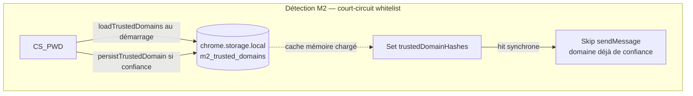
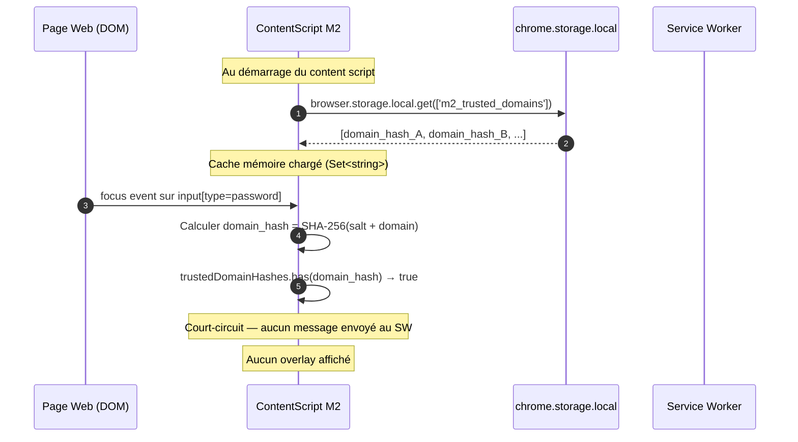

# Addendum DAT — Architecture triple couche whitelist M2

**Document de référence :** `p3-dat-v1.1.md`
**Addendum version :** 1.0
**Date :** 2026-04-12
**Auteur :** Architecte logiciel
**Statut :** Soumis au référent qualité

---

## 1. Contexte du changement

### 1.1 Problème identifié

Le DAT v1.1 §3.3 spécifie que toute persistance passe par le Service Worker via le MessageRouter. Cette règle a dû être contournée localement pour le module M2 en raison d'une race condition structurelle propre à Manifest V3.

**Race condition observée :** lorsque l'utilisateur focus un champ mot de passe sur une page ayant été marquée de confiance, le content script envoie un message `risk_detected` au SW. Or le SW MV3 peut être endormi au moment du focus. Le réveil du SW prend jusqu'à 200 ms (budget §10.1). Pendant ce délai, le content script n'a aucun moyen de savoir si le domaine est en whitelist, et le SW peut répondre trop tard pour éviter un flash d'overlay non souhaité — ou ne pas répondre du tout si le handler n'est pas encore enregistré (état `handler_not_registered`).

Ce problème est amplifié par le comportement fail-open du MessageRouter : en l'absence de réponse du SW dans le délai imparti, l'overlay M2 est affiché par défaut (choix sécurité). Or afficher un overlay sur un domaine de confiance explicitement validé par l'utilisateur est une dégradation fonctionnelle inacceptable.

### 1.2 Solution retenue

Introduction d'une architecture whitelist en triple couche pour le module M2, gérée directement dans le content script, sans dépendance synchrone au SW pour la lecture.

---

## 2. Nouvelle architecture — Triple couche whitelist M2

### 2.1 Schéma des trois couches

```
focus password field
        │
        ▼
┌───────────────────────────────────────────────────────────┐
│  COUCHE 1 — Cache mémoire (Set<string>)                   │
│  `trustedDomainHashes` — content script                   │
│  Lecture : synchrone, 0 ms                                │
│  Écriture : immédiate à chaque "confiance" utilisateur    │
│  Périmètre : onglet courant, vidé à la fermeture          │
└──────────────────────┬────────────────────────────────────┘
                       │  Miss (domaine inconnu)
                       ▼
┌───────────────────────────────────────────────────────────┐
│  COUCHE 2 — chrome.storage.local                          │
│  Clé : `m2_trusted_domains` (string[])                    │
│  Accès : content script direct (sans SW)                  │
│  Lecture : au démarrage du content script (loadTrustedDomains)│
│  Écriture : à chaque "confiance" (persistTrustedDomain)   │
│  Périmètre : installation, survit aux rechargements       │
└──────────────────────┬────────────────────────────────────┘
                       │  Non chargé ou erreur → fallback
                       ▼
┌───────────────────────────────────────────────────────────┐
│  COUCHE 3 — IndexedDB store `whitelist`                   │
│  Via SW → StorageService.isWhitelisted() / addToWhitelist()│
│  Écriture : via message `overlay_action { user_action: 'trusted' }`│
│  Lecture : dans handleRiskDetected (SW) uniquement        │
│  Périmètre : installation, chiffré AES-256-GCM            │
└───────────────────────────────────────────────────────────┘
```

### 2.2 Comportement par flux

**Flux lecture (focus champ mot de passe) :**

1. Le content script consulte d'abord le cache mémoire (couche 1) — synchrone.
2. Si le cache est vide pour ce hash, le chargement initial depuis `chrome.storage.local` a déjà été effectué au démarrage du content script (`loadTrustedDomains`). Si le domaine y figurait, il est dans le cache mémoire.
3. Si le domaine n'est pas en cache : le message `risk_detected` est envoyé au SW. Le SW consulte alors l'IndexedDB (couche 3) via `StorageService.isWhitelisted()`.

**Flux écriture (action "confiance" utilisateur) :**

1. Le content script ajoute immédiatement le hash au cache mémoire (couche 1).
2. Le content script persiste dans `chrome.storage.local` (couche 2) via `persistTrustedDomain()`.
3. Simultanément, le message `overlay_action { user_action: 'trusted' }` est envoyé au SW qui persiste dans IndexedDB via `StorageService.addToWhitelist()` (couche 3).

**Garantie de cohérence :** les couches 1 et 2 constituent un cache en avant de la couche 3. Elles ne se substituent pas à la couche 3 pour la lecture de référence (réalisée côté SW), mais elles permettent un court-circuit immédiat avant même le réveil du SW.

### 2.3 Clés de stockage introduites

| Couche | Portée | Clé / Identifiant | Type |
|--------|--------|-------------------|------|
| 1 — Mémoire | Onglet courant | `trustedDomainHashes` (variable locale) | `Set<string>` |
| 2 — chrome.storage.local | Installation | `m2_trusted_domains` | `string[]` |
| 3 — IndexedDB | Installation | store `whitelist`, keyPath `domain_hash` | `WhitelistEntry` (chiffré) |

---

## 3. Sections du DAT impactées

### 3.1 §3.3 Communication inter-composants — Tableau des flux

**Modification à apporter :** ajouter une ligne au tableau des flux.

| Source | Destination | API | Direction | Usage |
|--------|-------------|-----|-----------|-------|
| Content Script M2 | chrome.storage.local | `browser.storage.local.get/set()` | Direct (sans SW) | Lecture/écriture whitelist M2 (`m2_trusted_domains`) — exception au pattern message-based, justifiée par la race condition MV3 (cf. ADR-006) |

**Note d'architecture à ajouter après le tableau :**

> Exception documentée (ADR-006) : le content script du module M2 accède directement à `chrome.storage.local` pour lire et écrire la clé `m2_trusted_domains`. Cet accès est limité à cette clé et à ce module. Il est déclenché uniquement au démarrage du content script (lecture initiale) et lors d'une action "confiance" utilisateur (écriture). Il ne contourne pas le MessageRouter pour la logique de décision (celle-ci reste dans le SW), mais court-circuite la couche de transport pour la persistance du cache whitelist.

### 3.2 §6.2 Flux de données par module — Diagramme Mermaid

**Modification à apporter :** ajouter un chemin direct entre le content script et `chrome.storage.local` pour la whitelist M2 dans le sous-graphe "Persistance chiffrée".



**Note à ajouter dans le diagramme §6.2 :**

> M2 dispose d'un court-circuit whitelist dans le content script (accès direct `chrome.storage.local`). Le message `risk_detected` n'est envoyé au SW que si le domaine n'est pas dans le cache mémoire local. La vérification définitive en IndexedDB est réalisée côté SW (couche 3).

### 3.3 §6.3 Diagramme de séquence — Scénario "domaine de confiance"

**Séquence à ajouter** (nouveau scénario alternatif au scénario nominal) :



### 3.4 §8.1 Schéma `chrome.storage.local` — Interface ChromeStorageSchema

**Modification à apporter :** ajouter la clé `m2_trusted_domains` à l'interface `ChromeStorageSchema`.

```typescript
// Whitelist M2 côté content script (cache persistant inter-sessions)
// Court-circuit avant envoi au SW — évite race condition MV3 réveil SW
m2_trusted_domains: string[];  // [domain_hash1, ...] — SHA-256(salt+domain)
```

**Note à ajouter :**

> Cette clé est distincte de `m2_session_domains`. Elle contient les domaines explicitement marqués de confiance par l'utilisateur (persistance permanente jusqu'à effacement volontaire). La clé `m2_session_domains` contient uniquement les domaines déjà nudgés dans la session courante (déduplication session, pas de confiance permanente).

### 3.5 §9.4 Nouvelle décision de sécurité D-SEC-006

**Décision à ajouter :**

```
#### D-SEC-006 : Accès direct chrome.storage.local depuis le content script M2

Contexte : La race condition MV3 (SW endormi au moment du focus) rend impossible
une vérification synchrone de la whitelist via le SW avant l'affichage de l'overlay M2.
Le fail-open du MessageRouter aggraverait l'expérience utilisateur sur les domaines
de confiance.

Décision : Le content script M2 accède directement à chrome.storage.local pour la
clé `m2_trusted_domains`. Cet accès est strictement limité à cette clé, à ce module,
et à deux opérations : lecture au démarrage, écriture sur action "confiance".

Surface d'attaque : Toute page web avec un champ password peut exécuter du code
dans le content script. Cependant, le content script s'exécute dans un contexte
isolé (Isolated World) — la page web n'a pas accès à `chrome.storage.local` ni aux
variables du content script. Le risque d'injection via la whitelist est nul.

Risque résiduel : Si `chrome.storage.local` est corrompu ou indisponible,
`loadTrustedDomains()` retourne silencieusement sans modifier le cache. Le SW
conserve la vérification IndexedDB comme autorité de référence. Mode dégradé :
un domaine de confiance peut recevoir un overlay si le cache mémoire est vide ET
que le SW répond avant le timeout (comportement nominal sans court-circuit).

Alternatives rejetées :
- Vérification synchrone via SW uniquement : impossible en MV3 (SW peut être mort
  au moment du focus).
- SharedArrayBuffer : non disponible dans les extensions Chrome.
- Pré-envoi de la whitelist au démarrage de l'onglet via tabs.sendMessage : fragile
  (SW peut ne pas être disponible au moment de l'injection du content script).
```

---

## 4. ADR associé

```
### ADR-006 : Accès direct chrome.storage.local pour la whitelist M2

Contexte :
Le module M2 doit éviter d'afficher un overlay sur un domaine que l'utilisateur
a explicitement marqué de confiance. En MV3, le Service Worker peut être endormi
au moment du focus sur le champ mot de passe. Le réveil prend jusqu'à 200 ms.
Le fail-open du MessageRouter (overlay affiché en cas de non-réponse) crée une
régression fonctionnelle sur les domaines whitelistés.

Décision :
Le content script M2 maintient un cache whitelist en deux niveaux locaux
(mémoire Set + chrome.storage.local clé `m2_trusted_domains`) en parallèle
de la whitelist IndexedDB gérée par le SW. L'accès à chrome.storage.local
est direct, sans passer par le MessageRouter.

Alternatives rejetées :
- Attendre la réponse du SW systématiquement : introduit un délai perceptible
  (jusqu'à 200 ms) et un risque de flash d'overlay sur domaine de confiance.
- Désactiver le fail-open pour M2 : contrevient à la décision de sécurité
  (l'overlay doit s'afficher même si le SW est lent).
- Partager la whitelist via tabs.sendMessage au démarrage de l'onglet : fragile,
  le SW peut ne pas être disponible lors de l'injection initiale du content script.

Conséquences positives :
- Zéro flash d'overlay sur domaine de confiance, quelle que soit la latence SW.
- Disponibilité immédiate de la whitelist dès le premier focus.
- Résistance aux redémarrages du SW entre deux navigations.

Conséquences négatives :
- Écart par rapport au pattern "toute persistance via SW" du DAT §3.3.
- Duplication de la whitelist sur trois couches — risque de divergence si une
  écriture échoue partiellement.
- Surface de code à maintenir dans le content script pour la synchronisation.

Plan B :
Si la duplication de la whitelist génère des divergences observées en production,
migrer vers un modèle où le SW envoie proactivement la whitelist complète au
content script via chrome.tabs.sendMessage lors du chargement de l'onglet
(message `whitelist_sync`), en conservant le cache mémoire uniquement.
Ce plan B nécessiterait de s'assurer que le SW est éveillé au moment de
l'injection du content script, ce qui est garanti si chrome.runtime.onInstalled
ou chrome.tabs.onUpdated est utilisé comme trigger.
```

---

## 5. Cohérence avec les exigences non fonctionnelles

| Exigence (cahier des charges) | Impact de l'addendum |
|-------------------------------|---------------------|
| Privacy by design — aucune donnée ne quitte l'appareil | Aucun impact. `chrome.storage.local` est local. |
| Délai affichage nudge < 500 ms P99 | Amélioration : le court-circuit supprime le délai de réveil SW (jusqu'à 200 ms) pour les domaines de confiance. |
| Fail-open M2 (overlay affiché même si SW endormi) | Préservé. Le court-circuit ne désactive pas le fail-open — il le court-circuite uniquement quand le domaine est en whitelist. |
| Droit d'effacement RGPD (Art. 17) | La clé `m2_trusted_domains` doit être incluse dans l'effacement `chrome.storage.local.clear()`. Vérifier que la page Options l'inclut bien dans le bouton "Supprimer toutes mes données" et dans "Réinitialiser la whitelist". |

---

## 6. Points d'attention pour le développeur

1. **Cohérence des clés** : `m2_trusted_domains` (couche 2) et le store `whitelist` IndexedDB (couche 3) doivent contenir les mêmes `domain_hash`. Toute action "confiance" doit écrire dans les deux couches (le content script écrit la couche 2, le message `overlay_action` au SW écrit la couche 3).

2. **Effacement** : la page Options doit effacer `m2_trusted_domains` lors de "Réinitialiser la whitelist" et lors de "Supprimer toutes mes données".

3. **Tests** : prévoir un test unitaire vérifiant que `loadTrustedDomains()` charge correctement le cache mémoire depuis `chrome.storage.local`, et que `persistTrustedDomain()` n'écrit pas de doublons.

4. **Divergence couche 2 / couche 3** : en cas d'échec de l'écriture IndexedDB (RT-006), la couche 2 peut contenir un domaine absent de la couche 3. Ce domaine restera de confiance dans le content script mais le SW pourra l'afficher si le cache mémoire est vide (ex : rechargement de page après crash SW). Ce cas est acceptable (affichage ponctuel sur un domaine de confiance) et documenté dans RISQUES.md sous RT-007.

---

*Addendum produit par l'Architecte logiciel — à soumettre au référent qualité avant intégration au DAT v1.2.*
