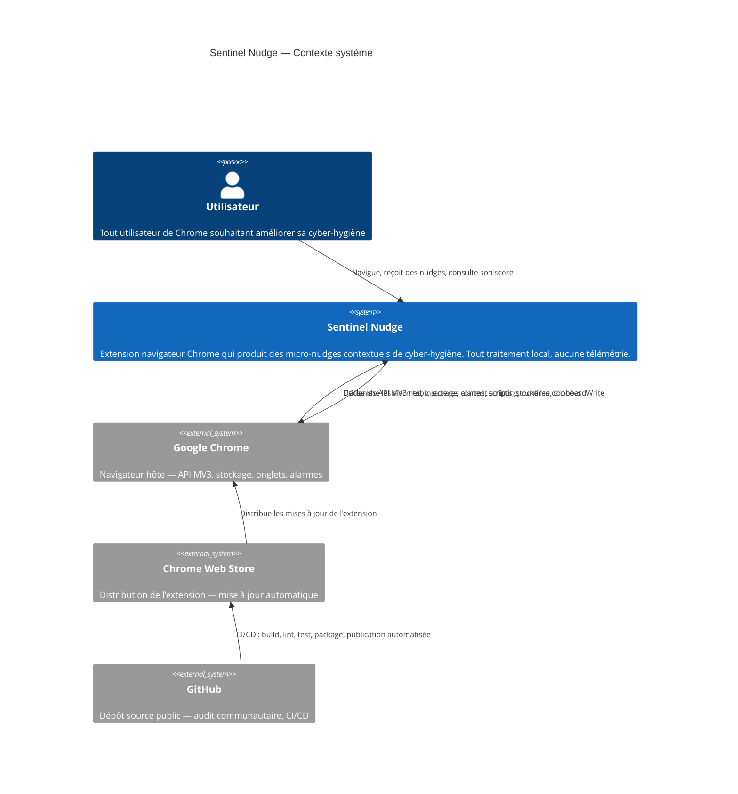
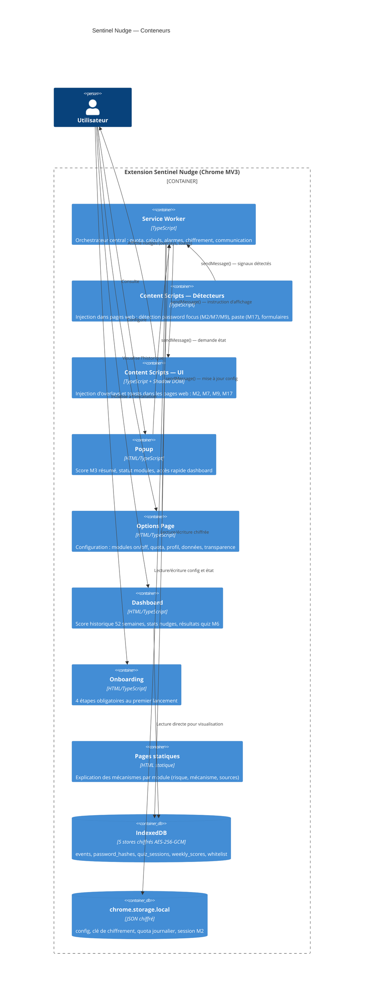
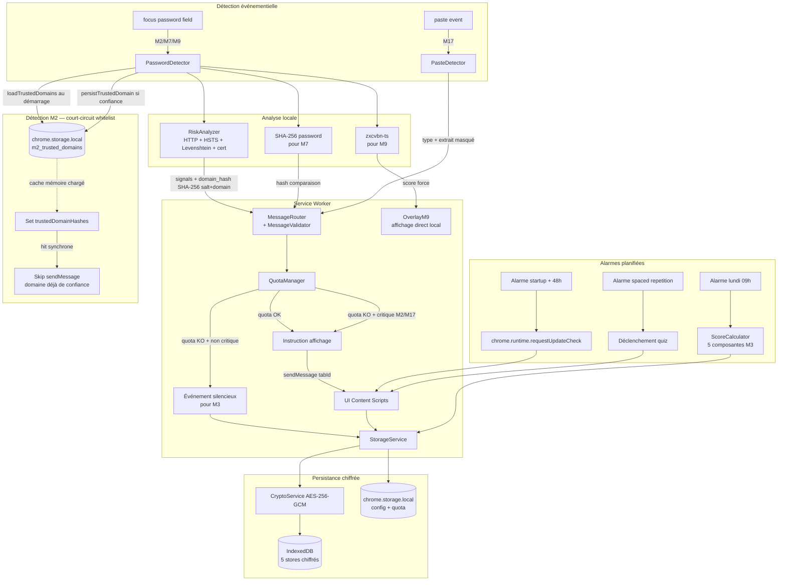
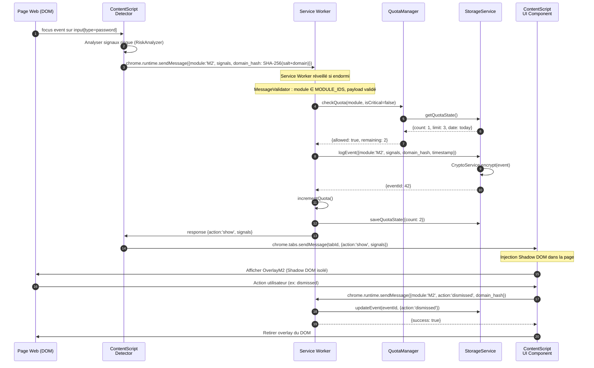
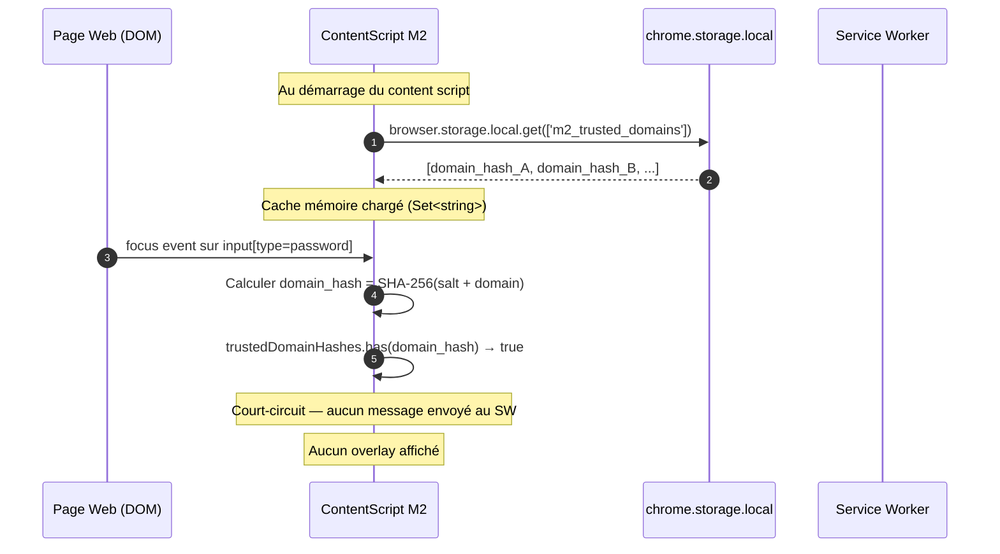
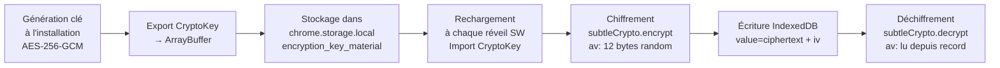

# Document d'Architecture Technique — Sentinel Nudge v1

## Phase P3 — Architecte logiciel

**Projet :** Sentinel Nudge
**Version :** 1.5
**Date de production :** 2026-04-19
**Statut :** Consolidation 6 corrections revue Fabrique 19/04 (A-06, T-028, T-062, T-091, T-187)
**Commanditaire :** Antony (RSSI)
**Niveau de sensibilité :** Exposé
**Documents de référence :**

- `p1-cahier-des-charges-v1.1.md`
- `p2-sfd-v1.1.md`
- `gouvernance-pv-securite-p2-v1.0.md`
- `gouvernance-pv-comite-architecture-p3-v1.0.md`

---

## Table des matières

1. Introduction
2. Vue d'ensemble de l'architecture
   - 2.1 Principes directeurs
   - 2.2 Diagramme de contexte (C4 — Niveau 1)
3. Architecture technique Manifest V3
   - 3.1 Composants MV3
   - 3.2 Diagramme de conteneurs (C4 — Niveau 2)
   - 3.3 Communication inter-composants
4. Stack technique
   - 4.1 Tableau récapitulatif
   - 4.2 Décisions architecturales (ADR)
5. Structure du projet
6. Diagrammes de composants et de flux
   - 6.1 Diagramme de composants (C4 — Niveau 3)
   - 6.2 Flux de données par module
   - 6.3 Séquence content script ↔ service worker
7. Couche d'abstraction navigateur
8. Stockage et données
   - 8.1 Schéma IndexedDB
   - 8.2 Chiffrement AES-256-GCM
   - 8.3 Politique de purge
   - 8.4 Migration de schéma
9. Sécurité
   - 9.1 Content Security Policy
   - 9.2 Permissions minimales
   - 9.3 Sanitisation et intégrité du DOM
   - 9.4 Décisions de sécurité D-SEC-001 à D-SEC-006
10. Performance
    - 10.1 Budget de performance
    - 10.2 Stratégies d'optimisation
    - 10.3 Lazy loading
11. Accessibilité
    - 11.1 Patterns ARIA
    - 11.2 Shadow DOM et accessibilité
    - 11.3 Gestion du focus
    - 11.4 Design System — tokens CSS
    - 11.5 Dashboard — accessibilité des graphiques SVG
12. Internationalisation
    - 12.1 Architecture i18n
    - 12.2 Structure \_locales
13. Déploiement
    - 13.1 Pipeline CI/CD
    - 13.2 SBOM
    - 13.3 Chrome Web Store
14. Matrice de traçabilité DAT → SFD → CdC
15. Risques techniques
16. Limitations techniques connues
    - 16.1 Iframes cross-origin — Same-Origin Policy
17. Algorithmes de hachage de domaines
    - 17.1 Vue d'ensemble — deux espaces de hash cloisonnés
    - 17.2 FNV-1a : fallback content script (contextes non sécurisés HTTP)
    - 17.3 SHA-256 + sel HMAC : canal cryptographique (M7 et tous les modules en HTTPS)
    - 17.4 Tableau des sites d'usage dans le code source
    - 17.5 Risque R-SEC-02 — collision FNV-1a et frontière d'emploi
    - 17.6 Matrice de conformité ISO 27001 A.8.24
18. Badge dégradé popup (TACHE-062)
19. Analyse statique SAST — CodeQL (T-187)

> **Note v1.5 :** ADR-001 (SW-BOOT-CONTRACT) et ADR-002 (CROSS-LIFECYCLE-INTENT) sont externalisés dans `docs/adr/` (décisions cross-cutting P5). Les ADR-003 à ADR-008 demeurent dans le corps du présent document (conformément à la règle Commanditaire 19/04 : pas de démultiplication des documents).

---

## 1. Introduction

### 1.1 Objectif du document

Le Document d'Architecture Technique (DAT) formalise l'ensemble des décisions d'architecture pour Sentinel Nudge v1. Il est le contrat technique entre la phase de conception (P3) et la phase de développement (P4-P5). Il couvre :

- La structure des composants MV3 (Service Worker, Content Scripts, pages UI)
- La stack technologique retenue et justifiée
- L'organisation des données locales (IndexedDB, chrome.storage.local)
- Les décisions de sécurité intégrées depuis le comité P2
- Les contraintes de performance, d'accessibilité et de privacy by design
- La couche d'abstraction navigateur pour la portabilité future

### 1.2 Périmètre

Ce DAT couvre les 7 modules v1 (M2, M3, M5, M6, M7, M9, M17) et les composants transversaux (quota, stockage, onboarding, paramètres, dashboard, i18n, pages statiques). La compatibilité Firefox/Edge est préparée via une couche d'abstraction sans être implémentée en v1.

### 1.3 Postulats fondateurs

| #   | Postulat                                                                                                            | Source                   |
| --- | ------------------------------------------------------------------------------------------------------------------- | ------------------------ |
| A1  | Aucune donnée ne quitte le poste de l'utilisateur, sauf l'appel natif MV3 de M5 (chrome.runtime.requestUpdateCheck) | CdC §3.1                 |
| A2  | Manifest V3 obligatoire — pas de background page persistante                                                        | CdC §4.1                 |
| A3  | Licence GPL v3 — toute dépendance doit être compatible                                                              | p1-analyse-licences v1.0 |
| A4  | Permissions minimales — aucune permission inutile même si elle faciliterait l'implémentation                        | CdC §4.1                 |
| A5  | Tout embarqué — corpus quiz, HSTS preload list, zxcvbn, pas de CDN                                                  | SFD §3.2, D-SEC          |

---

## 2. Vue d'ensemble de l'architecture

### 2.1 Principes directeurs

| Principe                     | Description                                                                                             | Impact                                                 |
| ---------------------------- | ------------------------------------------------------------------------------------------------------- | ------------------------------------------------------ |
| **Privacy by design**        | Tout traitement dans le contexte du navigateur de l'utilisateur. Aucune API externe, aucune télémétrie. | Aucun appel réseau sortant sauf M5 (API native Chrome) |
| **Défense en profondeur**    | CSP stricte, sanitisation DOM, chiffrement au repos, permissions minimales                              | Architecture sécurité multicouche                      |
| **Paternalisme libertarien** | Chaque module est désactivable, aucune action n'est bloquée                                             | Design modulaire avec interrupteurs                    |
| **Dégradation gracieuse**    | Absence d'un composant (ex. HSTS list non chargée) ne bloque pas le reste                               | Gestion d'erreur par module                            |
| **Legèreté**                 | Extension < 5 Mo, CPU < 0.1 %, mémoire < 20 Mo                                                          | Pas de framework UI lourd, lazy loading                |
| **Portabilité**              | Couche d'abstraction navigateur dès v1                                                                  | Compatibilité Firefox/Edge préparée                    |

### 2.2 Diagramme de contexte (C4 — Niveau 1)



---

## 3. Architecture technique Manifest V3

### 3.1 Composants MV3

Manifest V3 impose un modèle d'exécution radicalement différent de MV2 :

| Composant MV3       | Rôle                                                                                                 | Durée de vie                           | Contraintes                                                  |
| ------------------- | ---------------------------------------------------------------------------------------------------- | -------------------------------------- | ------------------------------------------------------------ |
| **Service Worker**  | Cerveau de l'extension. Gère le quota, le stockage, les alarmes, les calculs M3/M7, la communication | Éphémère — tué après ~30s d'inactivité | Pas d'accès au DOM, pas de variables persistantes en mémoire |
| **Content Scripts** | Injectés dans les pages web. Détectent les événements DOM (password focus, paste, input)             | Vie de la page                         | Accès DOM uniquement, pas aux API Chrome complètes           |
| **Popup**           | Interface de l'icône de la barre d'outils — score rapide + statut modules                            | Vie de l'ouverture de la popup         | Fenêtre détruite à la fermeture                              |
| **Options Page**    | Page paramètres (chrome://extensions) — configuration complète                                       | Onglet Chrome standard                 | Accès complet aux API Chrome                                 |
| **Dashboard**       | Tableau de bord — historique 52 semaines, stats                                                      | Onglet Chrome standard                 | Accès complet aux API Chrome                                 |
| **Onboarding**      | 4 étapes obligatoires au premier lancement                                                           | Onglet Chrome standard                 | Accès complet aux API Chrome                                 |
| **Pages statiques** | Explication des mécanismes comportementaux par module                                                | Onglets Chrome statiques               | HTML statique, aucun script externe                          |

**Conséquence architecturale critique du Service Worker éphémère :**
Toute donnée d'état doit être persistée dans `chrome.storage.local` ou IndexedDB avant la fin de chaque opération. Le Service Worker ne peut pas supposer que ses variables en mémoire survivent entre deux appels. Les opérations longues (calcul M3) sont décomposées en étapes atomiques avec persistance intermédiaire.

**Note — état initial de la popup :** Avant le premier lundi (premier calcul de score M3), la popup affiche un message d'accueil avec un compte à rebours vers la date du premier calcul de score. Aucune donnée de score n'est affichée tant qu'un premier calcul n'a pas été effectué.

### 3.2 Diagramme de conteneurs (C4 — Niveau 2)



### 3.3 Communication inter-composants

La communication suit exclusivement le modèle de passage de messages Chrome (aucun accès direct entre contextes).

| Source                  | Destination          | API                               | Direction                    | Usage                                                                                                                                        |
| ----------------------- | -------------------- | --------------------------------- | ---------------------------- | -------------------------------------------------------------------------------------------------------------------------------------------- |
| Content Script          | Service Worker       | `chrome.runtime.sendMessage()`    | Unidirectionnel avec réponse | Envoi d'événements détectés (M2, M7, M9, M17)                                                                                                |
| Service Worker          | Content Script       | `chrome.tabs.sendMessage(tabId)`  | Unidirectionnel              | Instruction d'affichage de nudge                                                                                                             |
| Popup/Options/Dashboard | Service Worker       | `chrome.runtime.sendMessage()`    | Requête/réponse              | Lecture état, mise à jour config                                                                                                             |
| Service Worker interne  | Service Worker       | Appels de fonctions directs       | Interne                      | Chiffrement, calcul M3, gestion quota                                                                                                        |
| Chrome Runtime          | Service Worker       | `chrome.alarms.onAlarm`           | Événement entrant            | Déclenchement M3 (lundi 09h), M5 (périodique), M6 (spaced repetition)                                                                        |
| Content Script M2       | chrome.storage.local | `browser.storage.local.get/set()` | Direct (sans SW)             | Lecture/écriture whitelist M2 (`m2_trusted_domains`) — exception au pattern message-based, justifiée par la race condition MV3 (cf. ADR-006) |

> **Exception documentée (ADR-006) :** le content script du module M2 accède directement à `chrome.storage.local` pour lire et écrire la clé `m2_trusted_domains`. Cet accès est limité à cette clé et à ce module. Il est déclenché uniquement au démarrage du content script (lecture initiale) et lors d'une action "confiance" utilisateur (écriture). Il ne contourne pas le MessageRouter pour la logique de décision (celle-ci reste dans le SW), mais court-circuite la couche de transport pour la persistance du cache whitelist.

**Format de message standardisé :**

```typescript
interface NudgeMessage {
  module: 'M2' | 'M3' | 'M5' | 'M6' | 'M7' | 'M9' | 'M17';
  action: string;
  payload: Record<string, unknown>;
  timestamp: number; // Date.now()
}

interface NudgeResponse {
  success: boolean;
  action: 'show' | 'skip' | 'error';
  reason?: string;
  data?: Record<string, unknown>;
}
```

**Validation runtime des messages — module `message-validator.ts` (NC-SEC-01) :**

Tout message entrant dans le Service Worker est validé avant traitement par le module `src/shared/utils/message-validator.ts`. Ce module applique deux niveaux de validation :

1. **Validation du champ `module`** : le champ est vérifié contre la liste blanche `MODULE_IDS` définie dans `src/shared/constants/modules.ts`. Tout message dont le champ `module` n'appartient pas à cette liste est rejeté silencieusement.

2. **Validation de la structure du `payload`** : chaque module déclare un type guard strict correspondant à la forme attendue de son `payload`. Le router n'invoque le handler de module qu'après passage de ce type guard.

3. **Rejet silencieux** : les messages non conformes (module inconnu, payload malformé) sont ignorés sans lever d'exception ni répondre à l'émetteur, afin d'éviter toute fuite d'information sur la surface d'attaque.

```typescript
// src/shared/utils/message-validator.ts

import { MODULE_IDS, type ModuleId } from '../constants/modules';

export function isValidModuleId(value: unknown): value is ModuleId {
  return typeof value === 'string' && (MODULE_IDS as readonly string[]).includes(value);
}

export function validateNudgeMessage(msg: unknown): msg is NudgeMessage {
  if (typeof msg !== 'object' || msg === null) return false;
  const m = msg as Record<string, unknown>;
  if (!isValidModuleId(m['module'])) return false;
  if (typeof m['action'] !== 'string') return false;
  if (typeof m['payload'] !== 'object' || m['payload'] === null) return false;
  if (typeof m['timestamp'] !== 'number') return false;
  return true;
}

// Type guards par module (exemples)
export function isM2Payload(payload: unknown): payload is M2Payload {
  if (typeof payload !== 'object' || payload === null) return false;
  const p = payload as Record<string, unknown>;
  return Array.isArray(p['signals']) && typeof p['domain_hash'] === 'string';
}

export function isM7Payload(payload: unknown): payload is M7Payload {
  if (typeof payload !== 'object' || payload === null) return false;
  const p = payload as Record<string, unknown>;
  return typeof p['hash'] === 'string' && typeof p['domain_hash'] === 'string';
}
```

**Usage dans `message-router.ts` :**

```typescript
chrome.runtime.onMessage.addListener((msg, _sender, sendResponse) => {
  if (!validateNudgeMessage(msg)) {
    // Rejet silencieux — ne pas répondre
    return false;
  }
  // Dispatch vers le handler du module
  handleValidatedMessage(msg, sendResponse);
  return true;
});
```

---

## 4. Stack technique

### 4.1 Tableau récapitulatif

| Catégorie           | Technologie                           | Version   | Licence                                                       | Gratuit     |
| ------------------- | ------------------------------------- | --------- | ------------------------------------------------------------- | ----------- |
| Langage             | TypeScript                            | 5.x       | Apache 2.0                                                    | Oui         |
| Build               | Vite + vite-plugin-web-extension      | 5.x / 0.x | MIT                                                           | Oui         |
| UI                  | Vanilla TypeScript + Shadow DOM natif | —         | —                                                             | Oui         |
| Tests unitaires     | Vitest                                | 2.x       | MIT                                                           | Oui         |
| Tests E2E extension | Playwright + playwright-crx           | 1.x       | Apache 2.0                                                    | Oui         |
| Tests accessibilité | @axe-core/playwright                  | 4.x       | MPL 2.0                                                       | Oui         |
| Linting             | ESLint 9 + @typescript-eslint         | 9.x       | MIT                                                           | Oui         |
| Formatage           | Prettier                              | 3.x       | MIT                                                           | Oui         |
| Force mdp           | zxcvbn-ts                             | 3.x       | MIT                                                           | Oui         |
| Crypto              | SubtleCrypto (Web Crypto API native)  | —         | —                                                             | Oui (natif) |
| i18n                | chrome.i18n (API native MV3)          | —         | —                                                             | Oui (natif) |
| CI/CD               | GitHub Actions                        | —         | Gratuit (2 000 min/mois sur dépôt privé, illimité sur public) | Oui         |
| SBOM                | Syft (Anchore)                        | latest    | Apache 2.0                                                    | Oui         |

**Note `@axe-core/playwright` :** Intégré dans le workflow `ci.yml` pour la vérification automatisée des critères WCAG 2.1 AA à chaque PR. Licence MPL 2.0 compatible avec la distribution GPL v3 de l'extension (licence distincte pour l'outillage de développement).

### 4.2 Décisions architecturales (ADR)

> **Note v1.5 :** ADR-001 (SW-BOOT-CONTRACT) et ADR-002 (CROSS-LIFECYCLE-INTENT) sont des décisions cross-cutting produites en phase P5 (post-mortem M7). Elles sont externalisées dans `docs/adr/` pour permettre leur consultation indépendamment du DAT. Les ADR-003 à ADR-008 demeurent dans le corps du présent document.
>
> - `docs/adr/adr-001-sw-boot-contract.md` — Séquence de boot obligatoire en 4 étapes pour tout handler SW ayant un prérequis storage (Accepted, 2026-04-16)
> - `docs/adr/adr-002-cross-lifecycle-intent.md` — Persistance TTL de toute action traversant une frontière de cycle de vie SW (Accepted, 2026-04-16)

#### Note de conformité M7 — champ `expires_at` (TACHE-091 / E-CLI-01)

L'ADR-002 spécifie que tout intent cross-lifecycle doit contenir un champ `expires_at: number` (timestamp ms, `Date.now() + TTL`). Cette spécification a été appliquée dans l'implémentation M7 (`pending_m7_toast` dans `m7-handler.ts`) sous le nom `expires_at`.

Une non-conformité E-CLI-01 a été identifiée et corrigée en T-091 : la version initiale de `pending_m7_toast` utilisait le champ `timestamp` (émission) au lieu de `expires_at` (expiration), rendant le contrôle TTL côté consommateur impossible. La correction aligne l'implémentation sur l'invariant ADR-002 :

```typescript
// m7-handler.ts — intent cross-lifecycle conforme ADR-002
const PENDING_M7_TTL_MS = 30_000; // 30 secondes

await browser.storage.local.set({
  pending_m7_toast: {
    hash: payload.hash,
    domain_hash: payload.domain_hash,
    expires_at: Date.now() + PENDING_M7_TTL_MS, // conforme ADR-002 : TTL absolu
    // NB: 'timestamp' (ancienne valeur) rejeté — ne permettait pas le contrôle expiration
  }
});
```

**Règle générale (ADR-002, invariant)** : tout intent stocké DOIT utiliser `expires_at` (timestamp absolu d'expiration, calculé à l'émission). Le champ `timestamp` peut coexister pour la traçabilité forensique, mais ne remplace pas `expires_at` pour le contrôle de validité.

---

#### ADR-003 : Vanilla TypeScript + Shadow DOM sans framework UI

- **Contexte :** Les overlays et toasts injectés dans les pages web (M2, M7, M9, M17) doivent être isolés du CSS de la page hôte. Le choix s'impose entre un framework UI (React, Vue, Svelte) et du TypeScript natif avec Shadow DOM.
- **Décision :** Vanilla TypeScript avec Shadow DOM natif pour tous les composants UI injectés dans les pages web. Les pages internes (popup, options, dashboard, onboarding) utilisent également Vanilla TypeScript avec des Web Components.
- **Alternatives rejetées :**
  - React : +140 Ko min+gzip non justifiés, overhead MV3 (pas de virtual DOM utile pour des composants aussi simples), risque de conflit de contexte d'exécution entre content script et page hôte.
  - Vue 3 (Composition API) : +80 Ko, mêmes objections sur le poids. Pertinent pour des dashboards complexes mais surdimensionné ici.
  - Svelte : taille minimale attractive (~10 Ko), mais génère du JS qui manipule directement le DOM global — problème d'isolation dans les content scripts.
  - Lit (Google Web Components library) : option viable (~6 Ko), cependant ajoute une dépendance externe sans bénéfice décisif sur du Vanilla TypeScript pour ce périmètre.
- **Conséquences :** Components légers, isolation CSS garantie par Shadow DOM, pas de virtual DOM, code plus verbeux mais plus transparent pour les auditeurs communautaires. Budget taille respecté.
- **Plan B :** Si la complexité du dashboard s'avère excessive en Vanilla (v2+), adopter Lit pour les Web Components du dashboard uniquement. La couche Shadow DOM reste inchangée pour les content scripts.

---

#### ADR-004 : Web Crypto API (SubtleCrypto) sans bibliothèque externe

- **Contexte :** Le chiffrement AES-256-GCM des données IndexedDB requiert une bibliothèque ou une API crypto. Plusieurs options existent : crypto-js (npm), noble-ciphers (npm), SubtleCrypto (natif navigateur).
- **Décision :** SubtleCrypto (Web Crypto API) native Chrome, sans dépendance externe.
- **Alternatives rejetées :**
  - crypto-js : bibliothèque vieillissante, non auditée récemment pour MV3, poids inutile, implémentation en JS pur moins performante que l'API native.
  - noble-ciphers (@noble/ciphers) : excellente bibliothèque auditée, MIT, mais ajoute ~20 Ko alors que SubtleCrypto est disponible nativement dans Chrome avec des performances GPU-accélérées.
- **Conséquences :** Zéro dépendance pour la cryptographie, performances optimales (implémentation native C++), API asynchrone (Promises) — code plus verbeux que crypto-js mais plus fiable.
- **Plan B :** Si SubtleCrypto s'avère insuffisant pour un besoin futur (ex. clé dérivée PBKDF2 avec paramètres custom), adopter @noble/ciphers qui est déjà dans la liste de surveillance.

---

#### ADR-005 : Vitest + Playwright pour les tests

- **Contexte :** Besoins de test : tests unitaires (logique métier, chiffrement, calcul M3), tests d'intégration (communication SW ↔ CS), tests E2E (comportement réel de l'extension dans Chrome).
- **Décision :** Vitest 2.x pour les tests unitaires et d'intégration. Playwright 1.x + `playwright-crx` pour les tests E2E de l'extension. `@axe-core/playwright` pour les tests d'accessibilité automatisés.
- **Alternatives rejetées :**
  - Jest : plus lent que Vitest (pas de ESM natif), configuration TypeScript plus complexe. Vitest est le successeur naturel dans l'écosystème Vite.
  - Selenium/WebDriver : non recommandé pour les extensions Chrome, API moins fiable que Playwright pour ce cas d'usage.
  - Cypress : ne supporte pas nativement les extensions Chrome MV3 en 2026.
- **Conséquences :** Pipeline de test unifié (même outillage Vite/Vitest), coverage natif via v8, tests E2E réalistes via Playwright-CRX qui charge l'extension réelle dans Chrome, vérification WCAG automatisée via axe-core à chaque PR.
- **Plan B :** Si `playwright-crx` ne supporte pas une API MV3 future, isoler les tests d'intégration SW dans un environnement `chrome-mock` avec `chrome-extension-testing-utils`.

---

#### ADR-006 : Vite comme outil de build (performance budgets)

- **Contexte :** L'extension doit peser < 5 Mo, et les performances à l'exécution doivent être < 0.1 % CPU au repos, < 20 Mo RAM, nudge < 500 ms.
- **Décision :** Configuration Vite avec tree-shaking agressif, code splitting par entry point, et vérification de bundle size en CI.
- **Alternatives rejetées :** Aucune — cette décision est une configuration de l'ADR-002.
- **Conséquences :** Chaque entry point (SW, CS détecteur, CS UI par module, popup, options, dashboard, onboarding) est compilé séparément. zxcvbn-ts est importé uniquement dans le CS UI de M9. Le corpus M6 et la HSTS list sont des JSON statiques chargés à la demande.
- **Plan B :** Si le bundle dépasse 5 Mo, externaliser le corpus M6 en fichier JSON séparé (déjà prévu) et compresser la HSTS list via un bitset compact.

---

#### ADR-007 : Exigences non fonctionnelles → décisions architecturales

| ENF                 | Valeur cible | Décision architecturale                                                                                                 |
| ------------------- | ------------ | ----------------------------------------------------------------------------------------------------------------------- |
| CPU repos           | < 0.1 %      | Service Worker éphémère (ne tourne pas en arrière-plan continu), alarmes Chrome pour les tâches périodiques             |
| Mémoire             | < 20 Mo      | Pas de framework UI, lazy loading content scripts par module, zxcvbn chargé uniquement sur activation M9                |
| Taille extension    | < 5 Mo       | Corpus quiz JSON compressé, HSTS list en format compact (domaines hachés), zxcvbn-ts (~400 Ko)                          |
| Nudge < 500 ms      | P99          | Content script préchargé à `document_idle`, décision de quota en mémoire locale (cache 60s), UI Shadow DOM sans reflow  |
| zxcvbn < 100 ms     | P99          | zxcvbn-ts est synchrone et local — 100 ms atteint sur CPU moyen dès v1 de la bibliothèque                               |
| WCAG 2.1 AA         | —            | Shadow DOM + ARIA live regions, focus trap dans overlays modaux, cibles 44×44px, contraste 4.5:1 enforced en tokens CSS |
| 99.9% dispo locale  | —            | Extension locale = disponibilité = Chrome disponible. Dégradation gracieuse si un store IndexedDB échoue                |
| Volumétrie 10 GB/an | N/A          | Traitement 100% local, IndexedDB par utilisateur. Purge 90j/52 semaines garantit < 50 Mo par utilisateur                |

---

## 5. Structure du projet

```
sentinel-nudge/
├── .github/
│   └── workflows/
│       ├── ci.yml                    # Lint, test, build, axe-core sur chaque PR
│       └── release.yml               # Build release + SBOM + publication CWS
├── .claude/                          # Fichiers de mémoire Fabrique
├── docs/                             # Documentation projet
│   ├── p1-besoin/
│   ├── p2-specifications/
│   ├── p3-architecture/              # Ce document
│   └── gouvernance/
├── src/
│   ├── manifest.json                 # Source de vérité MV3
│   ├── background/
│   │   ├── service-worker.ts         # Entry point Service Worker
│   │   ├── quota-manager.ts          # Gestion quota journalier
│   │   ├── score-calculator.ts       # Calcul score M3 (5 composantes)
│   │   ├── crypto-service.ts         # AES-256-GCM via SubtleCrypto
│   │   ├── storage-service.ts        # Abstraction IndexedDB + chrome.storage
│   │   ├── alarm-manager.ts          # Gestion chrome.alarms (M3, M5, M6)
│   │   └── message-router.ts         # Routage messages entrants
│   ├── content-scripts/
│   │   ├── detectors/
│   │   │   ├── password-detector.ts  # Détection focus password (M2, M7, M9)
│   │   │   ├── paste-detector.ts     # Détection paste données sensibles (M17)
│   │   │   └── risk-analyzer.ts      # Analyse signaux risque M2 (HTTP, HSTS, Levenshtein, cert)
│   │   └── ui/
│   │       ├── base-nudge.ts         # Classe abstraite Web Component Shadow DOM
│   │       ├── overlay-m2.ts         # Overlay interstitiel M2
│   │       ├── overlay-m6.ts         # Overlay quiz M6
│   │       ├── overlay-m9.ts         # Overlay inline force mdp M9
│   │       ├── toast-m5.ts           # Toast mise à jour M5
│   │       ├── toast-m7.ts           # Toast réutilisation mdp M7
│   │       └── toast-m17.ts          # Toast copier-coller M17
│   ├── pages/
│   │   ├── popup/
│   │   │   ├── popup.html
│   │   │   ├── popup.ts
│   │   │   └── popup.css
│   │   ├── options/
│   │   │   ├── options.html
│   │   │   ├── options.ts
│   │   │   └── options.css
│   │   ├── dashboard/
│   │   │   ├── dashboard.html
│   │   │   ├── dashboard.ts
│   │   │   └── dashboard.css
│   │   ├── onboarding/
│   │   │   ├── onboarding.html
│   │   │   ├── onboarding.ts
│   │   │   └── onboarding.css
│   │   └── static/
│   │       ├── m2-explication.html
│   │       ├── m3-explication.html
│   │       ├── m5-explication.html
│   │       ├── m6-explication.html
│   │       ├── m7-explication.html
│   │       ├── m9-explication.html
│   │       └── m17-explication.html
│   ├── shared/
│   │   ├── types/
│   │   │   ├── messages.ts           # NudgeMessage, NudgeResponse, etc.
│   │   │   ├── storage.ts            # Schémas IndexedDB et chrome.storage
│   │   │   └── modules.ts            # ModuleId, ModuleConfig, etc.
│   │   ├── browser/
│   │   │   └── browser-adapter.ts    # Couche d'abstraction navigateur (ADR-008)
│   │   ├── utils/
│   │   │   ├── hash.ts               # SHA-256 via SubtleCrypto
│   │   │   ├── levenshtein.ts        # Algorithme Levenshtein pour M2
│   │   │   ├── sanitize.ts           # Fonctions textContent safe (D-SEC-003)
│   │   │   └── message-validator.ts  # Validation runtime des messages (NC-SEC-01)
│   │   └── constants/
│   │       ├── quota.ts              # QUOTA_DEFAULT = 3, QUOTA_OPTIONS = [3,5,10,Infinity]
│   │       └── modules.ts            # MODULE_IDS, CRITICAL_MODULES = ['M2','M7','M17']  ← M7 promu critique (T-091, aligne modules.ts)
│   ├── assets/
│   │   ├── icons/                    # icon16.png, icon48.png, icon128.png
│   │   ├── data/
│   │   │   ├── hsts-preload.json     # HSTS preload list compacte
│   │   │   ├── quiz-corpus.json      # 50+ questions bilingues FR/EN M6
│   │   │   └── typosquatting-targets.json # Domaines cibles Levenshtein M2
│   │   └── _locales/
│   │       ├── fr/
│   │       │   └── messages.json
│   │       └── en/
│   │           └── messages.json
│   └── lib/
│       └── zxcvbn-ts/                # Fork TypeScript de zxcvbn (MIT), embarqué
├── tests/
│   ├── unit/
│   │   ├── quota-manager.test.ts
│   │   ├── score-calculator.test.ts
│   │   ├── crypto-service.test.ts
│   │   ├── levenshtein.test.ts
│   │   ├── hash.test.ts
│   │   └── modules/
│   │       ├── m2.test.ts
│   │       ├── m3.test.ts
│   │       ├── m6.test.ts
│   │       ├── m7.test.ts
│   │       └── m17.test.ts
│   ├── integration/
│   │   ├── service-worker.test.ts
│   │   └── storage-service.test.ts
│   └── e2e/
│       ├── m2-overlay.spec.ts
│       ├── m9-inline.spec.ts
│       └── onboarding.spec.ts
├── vite.config.ts
├── tsconfig.json
├── tsconfig.test.json
├── eslint.config.js
├── .prettierrc
├── package.json
├── .env.example
├── .gitignore
└── LICENSE                           # GPL v3
```

---

## 6. Diagrammes de composants et de flux

### 6.1 Diagramme de composants (C4 — Niveau 3)

```mermaid
C4Component
    title Sentinel Nudge — Composants internes

    Container_Boundary(sw_bound, "Service Worker") {
        Component(router, "MessageRouter", "TypeScript", "Reçoit, valide via MessageValidator, et dispatche tous les messages entrants")
        Component(validator, "MessageValidator", "TypeScript", "Validation runtime : module contre liste blanche, payload par type guard strict")
        Component(quota, "QuotaManager", "TypeScript", "Gère le compteur journalier, exceptions critiques, file d'attente 24h")
        Component(score, "ScoreCalculator", "TypeScript", "Calcule le score M3 sur 5 composantes, 100 pts")
        Component(crypto, "CryptoService", "SubtleCrypto", "Chiffrement/déchiffrement AES-256-GCM, dérivation clé")
        Component(storage, "StorageService", "TypeScript", "Abstraction IndexedDB + chrome.storage.local, migration schéma")
        Component(alarm, "AlarmManager", "TypeScript", "Crée et gère les alarmes M3/M5/M6 via chrome.alarms")
    }

    Container_Boundary(cs_bound, "Content Scripts") {
        Component(pwd_det, "PasswordDetector", "TypeScript", "Écoute focus/blur/input sur <input type=password>")
        Component(paste_det, "PasteDetector", "TypeScript", "Écoute événement paste, détecte IBAN/CB/clé API (M17)")
        Component(risk, "RiskAnalyzer", "TypeScript", "Évalue signaux HTTP/HSTS/Levenshtein/cert pour M2")
        Component(base_ui, "BaseNudge", "TypeScript + Shadow DOM", "Classe abstraite Web Component : root Shadow DOM, focus trap, ARIA, tokens CSS")
        Component(overlay_m2, "OverlayM2", "TypeScript + Shadow DOM", "Overlay interstitiel 400px, 3 actions + explication")
        Component(overlay_m6, "OverlayM6", "TypeScript + Shadow DOM", "Overlay quiz M6 : 3 questions séquentielles, fieldset/legend, feedback, score final")
        Component(overlay_m9, "OverlayM9", "TypeScript + Shadow DOM", "Barre de force inline zxcvbn, suggestions")
        Component(toast_generic, "ToastNudge", "TypeScript + Shadow DOM", "Toast générique réutilisé par M5/M7/M17")
    }

    Container_Boundary(pages_bound, "Pages UI") {
        Component(popup_comp, "Popup", "TypeScript", "Score M3 résumé, modules actifs, lien dashboard")
        Component(options_comp, "Options", "TypeScript", "Configuration complète, droit effacement et portabilité données")
        Component(dash_comp, "Dashboard", "TypeScript", "Historique SVG 52 semaines, résultats quiz")
    }

    Rel(router, validator, "Valide chaque message entrant")
    Rel(router, quota, "Vérifie quota avant affichage")
    Rel(router, score, "Déclenche calcul M3 sur alarme")
    Rel(router, storage, "Lit/écrit via StorageService")
    Rel(crypto, storage, "Chiffre avant écriture, déchiffre après lecture")
    Rel(alarm, router, "Déclenche événements planifiés")
    Rel(pwd_det, router, "sendMessage M2/M7/M9")
    Rel(paste_det, router, "sendMessage M17")
    Rel(risk, pwd_det, "Résultat analyse signaux")
    Rel(router, overlay_m2, "sendMessage → show/skip")
    Rel(router, overlay_m6, "sendMessage → show/skip")
    Rel(router, toast_generic, "sendMessage → show/skip")
    Rel(overlay_m2, base_ui, "Hérite de BaseNudge")
    Rel(overlay_m6, base_ui, "Hérite de BaseNudge")
    Rel(overlay_m9, base_ui, "Hérite de BaseNudge")
    Rel(toast_generic, base_ui, "Hérite de BaseNudge")
    Rel(popup_comp, router, "sendMessage getState")
    Rel(options_comp, router, "sendMessage updateConfig")
    Rel(dash_comp, storage, "Lecture directe IndexedDB (déchiffrement local)")
```



**Spécification de l'overlay M6 (quiz — NC-UX-02) :**

L'overlay M6 est un dialog modal centré, largeur max 480px, avec les caractéristiques suivantes :

- **Structure générale :** `role="dialog"`, `aria-modal="true"`, `aria-labelledby` pointant vers le titre, focus trap actif dès l'ouverture.
- **Navigation séquentielle :** 3 questions présentées une par une avec un indicateur de progression visible ("1 / 3", "2 / 3", "3 / 3").
- **Chaque question :** encapsulée dans un `<fieldset>` dont le `<legend>` contient le texte de la question. Les réponses sont des `<input type="radio">` avec `<label>` associés, groupés dans le fieldset.
- **Feedback post-réponse :** après validation d'une réponse, le feedback (correct/incorrect + explication) est affiché dans le même dialog, en dessous de la question. Un bouton "Question suivante" (ou "Voir mon score" pour la dernière question) permet de progresser.
- **Score final :** affiché dans le dialog à l'issue des 3 questions, avec un bouton "Fermer" qui rend le focus au déclencheur et ferme le dialog.

### 6.2 Flux de données par module



> **M2 dispose d'un court-circuit whitelist dans le content script** (accès direct `chrome.storage.local`). Le message `risk_detected` n'est envoyé au SW que si le domaine n'est pas dans le cache mémoire local. La vérification définitive en IndexedDB est réalisée côté SW (couche 3).

**Note sur `domain_hash` :** dans les flux HTTPS (cas nominal), `domain_hash` est calculé par `SHA-256(installation_salt + domain)`. Le sel est propre à chaque installation (16 bytes, cf. D-SEC-001), ce qui empêche la corrélation inter-utilisateurs des hashes de domaine. Sur les pages HTTP (Module M2 spécifiquement), `SubtleCrypto` est indisponible : un fallback FNV-1a est activé automatiquement — ce hash est utilisé uniquement pour la déduplication session en mémoire locale et n’est jamais persisté en IDB. Ces deux espaces de hash sont cloisonnés et ne se croisent jamais en lecture (cf. **§17 — Algorithmes de hachage de domaines**).

### 6.3 Diagramme de séquence content script ↔ service worker



**Scénario alternatif M2 — domaine de confiance (court-circuit whitelist) :**



---

## 7. Couche d'abstraction navigateur

### ADR-008 : Couche d'abstraction navigateur dès v1

- **Contexte :** L'API `chrome.*` est spécifique à Chromium. Firefox utilise `browser.*` avec des Promises (et un `chrome.*` legacy partiel). Préparer la compatibilité Firefox/Edge dès v1 sans surcoût de développement.
- **Décision :** Créer un module `browser-adapter.ts` dans `src/shared/browser/` qui ré-exporte les API utilisées derrière une interface unifiée. En v1, l'implémentation est 100% `chrome.*`. En v2 Firefox, seul ce fichier change.
- **Alternatives rejetées :**
  - `webextension-polyfill` (Mozilla) : solution éprouvée, MIT, ~30 Ko. Rejeté non pas pour des raisons techniques mais pour maîtriser les dépendances et éviter un intermédiaire dont la maintenance dépend de Mozilla.
  - Appels directs à `chrome.*` partout dans le code : verrouille définitivement sur Chrome, migration Firefox = réécriture complète.
- **Conséquences :** Un fichier de 60-80 lignes à écrire en P4. Toute la codebase importe depuis `browser-adapter` plutôt que `chrome` directement.
- **Plan B :** Si la migration Firefox s'avère plus complexe que prévu, adopter `webextension-polyfill` et remplacer `browser-adapter.ts` par un wrapper autour de ce polyfill.

**Interface de la couche d'abstraction :**

```typescript
// src/shared/browser/browser-adapter.ts

export interface BrowserAdapter {
  storage: {
    local: {
      get(keys: string[]): Promise<Record<string, unknown>>;
      set(items: Record<string, unknown>): Promise<void>;
      remove(keys: string[]): Promise<void>;
    };
  };
  runtime: {
    sendMessage(message: unknown): Promise<unknown>;
    onMessage: {
      addListener(
        callback: (msg: unknown, sender: unknown, respond: (r: unknown) => void) => void,
      ): void;
    };
    requestUpdateCheck(): Promise<{ status: string }>;
  };
  tabs: {
    sendMessage(tabId: number, message: unknown): Promise<unknown>;
    query(queryInfo: object): Promise<chrome.tabs.Tab[]>;
  };
  alarms: {
    create(name: string, alarmInfo: chrome.alarms.AlarmCreateInfo): void;
    onAlarm: { addListener(callback: (alarm: chrome.alarms.Alarm) => void): void };
  };
  i18n: {
    getMessage(messageName: string, substitutions?: string | string[]): string;
  };
}

// Implémentation v1 Chrome
export const browser: BrowserAdapter = {
  storage: chrome.storage,
  runtime: chrome.runtime,
  tabs: chrome.tabs,
  alarms: chrome.alarms,
  i18n: chrome.i18n,
};
```

---

## 8. Stockage et données

### 8.1 Schéma IndexedDB

L'extension utilise une base IndexedDB nommée `sentinel-nudge-db` avec 5 object stores. Toutes les valeurs sont chiffrées avec AES-256-GCM avant écriture (cf. §8.2). Les clés (IDs) restent en clair pour permettre l'indexation.

**Base : `sentinel-nudge-db`, version initiale : 1**

| Store             | Clé primaire          | Index                              | Description                                                                                                                                                             | Rétention                    |
| ----------------- | --------------------- | ---------------------------------- | ----------------------------------------------------------------------------------------------------------------------------------------------------------------------- | ---------------------------- |
| `events`          | `id` (auto-increment) | `timestamp`, `module`              | Tous les événements de nudge (affichés, silencieux, actions utilisateur)                                                                                                | 90 jours                     |
| `password_hashes` | `id` (auto-increment) | `tag`, `domain_hash`, `first_seen` | Hashes des mots de passe détectés pour M7 (réutilisation) — FIFO max 100 entrées. Hash chiffré AES-256-GCM, index `tag` (4 premiers bytes) en clair pour pré-filtration | 90 jours                     |
| `quiz_sessions`   | `id` (auto-increment) | `module`, `quiz_date`              | Sessions quiz M6 (questions, réponses, scores)                                                                                                                          | 52 semaines                  |
| `weekly_scores`   | `week_key` (YYYY-Www) | `week_key`                         | Score M3 hebdomadaire et détail des 5 composantes                                                                                                                       | 52 semaines                  |
| `whitelist`       | `domain_hash`         | —                                  | Domaines marqués comme de confiance par l'utilisateur (M2). `domain_hash` = SHA-256(installation_salt + domain)                                                         | Permanent jusqu'à effacement |

**Schéma du store `events` (champ `value` chiffré) :**

```typescript
interface EventRecord {
  id: number; // auto-increment, en clair
  timestamp: number; // Date.now(), en clair pour index
  module: string; // 'M2'|'M3'|'M5'|'M6'|'M7'|'M9'|'M17', en clair pour index
  value: ArrayBuffer; // Contenu chiffré AES-256-GCM
  iv: Uint8Array; // IV (12 bytes), en clair pour déchiffrement
}

// Contenu déchiffré de value :
interface EventPayload {
  domain_hash?: string; // SHA-256(installation_salt + domain)
  signals?: string[];
  action?: string;
  score_delta?: number;
  module_data?: Record<string, unknown>;
}
```

**Schéma du store `password_hashes` (NC-DPO-01) :**

Le hash du mot de passe est stocké chiffré (AES-256-GCM) dans le champ `value`. Un index de pré-filtration `tag` (4 premiers bytes du hash en clair, valeur hexadécimale sur 8 caractères) permet de réduire les candidats à déchiffrer lors d'une recherche de réutilisation, sans exposer le hash complet.

```typescript
interface PasswordHashRecord {
  id: number; // auto-increment, clé primaire — en clair
  tag: string; // 4 premiers bytes du hash SHA-256 en hex (ex: "a3f2c1b0") — en clair, index secondaire pour pré-filtration
  value: ArrayBuffer; // SHA-256(installation_salt + password) chiffré AES-256-GCM
  iv: Uint8Array; // IV (12 bytes) pour déchiffrement du champ value
  domain_hash: string; // SHA-256(installation_salt + domain) — en clair, index
  first_seen: number; // Date.now() — en clair, index pour purge FIFO
  count: number; // Nombre de fois détecté — en clair
}
```

**`chrome.storage.local` (configuration et état volatile) :**

```typescript
interface ChromeStorageSchema {
  // Configuration utilisateur
  config: {
    modules: Record<ModuleId, boolean>; // modules actifs/inactifs
    quota_limit: 3 | 5 | 10 | null; // null = Tous
    profile: 'beginner' | 'intermediate' | 'advanced';
    onboarding_complete: boolean;
    language: 'fr' | 'en';
  };

  // Clé de chiffrement IndexedDB (voir D-SEC-004)
  encryption_key_material: ArrayBuffer; // Matériau exporté de la CryptoKey AES-256-GCM

  // État quota journalier (réinitialisé à minuit)
  quota_state: {
    date: string; // YYYY-MM-DD
    count: number; // Nudges affichés aujourd'hui
  };

  // Session M2 (domaines déjà nudgés dans la session courante)
  m2_session_domains: string[]; // [domain_hash1, domain_hash2, ...] — SHA-256(salt+domain)

  // Whitelist M2 côté content script (cache persistant inter-sessions)
  // Court-circuit avant envoi au SW — évite race condition MV3 réveil SW
  m2_trusted_domains: string[]; // [domain_hash1, ...] — SHA-256(salt+domain)

  // Installation salt pour D-SEC-001
  installation_salt: string; // 16 bytes (128 bits) en hexadécimal (32 caractères), généré via crypto.getRandomValues
}
```

> **Note sur `m2_trusted_domains` :** Cette clé est distincte de `m2_session_domains`. Elle contient les domaines explicitement marqués de confiance par l'utilisateur (persistance permanente jusqu'à effacement volontaire). La clé `m2_session_domains` contient uniquement les domaines déjà nudgés dans la session courante (déduplication session, pas de confiance permanente).

**Bases légales RGPD par store (T-ARCH-09) :**

| Store             | Base légale                         | Justification                                                        |
| ----------------- | ----------------------------------- | -------------------------------------------------------------------- |
| `events`          | Intérêt légitime (Art. 6.1.f)       | Nécessaire au fonctionnement de l'extension installée volontairement |
| `password_hashes` | Consentement explicite (Art. 6.1.a) | Opt-in lors de l'onboarding (étape dédiée M7)                        |
| `quiz_sessions`   | Intérêt légitime (Art. 6.1.f)       | Nécessaire au fonctionnement M6                                      |
| `weekly_scores`   | Intérêt légitime (Art. 6.1.f)       | Nécessaire au fonctionnement M3                                      |
| `whitelist`       | Intérêt légitime (Art. 6.1.f)       | Action volontaire et explicite de l'utilisateur                      |

### 8.2 Chiffrement AES-256-GCM

Le chiffrement protège les données comportementales de l'utilisateur au repos dans IndexedDB. Il s'appuie sur la Web Crypto API native (SubtleCrypto).

**Flux de chiffrement :**



**Paramètres de chiffrement :**

- Algorithme : AES-GCM
- Longueur de clé : 256 bits
- IV : 12 bytes (96 bits) généré aléatoirement par opération (`crypto.getRandomValues`)
- Tag d'authentification : 128 bits (défaut)
- Portée : toutes les valeurs `value` des records IndexedDB (stores `events`, `quiz_sessions`, `weekly_scores`, **`password_hashes`**)

**Note D-SEC-004 :** La clé AES est stockée dans `chrome.storage.local`, qui est incluse dans le profil Chrome de l'utilisateur. Ce risque est documenté et accepté : un attaquant avec accès au profil Chrome a déjà accès à l'ensemble des données du navigateur (cookies, mots de passe). La mitigation via PBKDF2 est prévue en v2+ si un besoin de chiffrement renforcé est exprimé.

### 8.3 Politique de purge

| Store             | Rétention               | Déclenchement purge                                         | Méthode                                                                                                        |
| ----------------- | ----------------------- | ----------------------------------------------------------- | -------------------------------------------------------------------------------------------------------------- |
| `events`          | 90 jours                | À chaque réveil du SW, vérification hebdomadaire via alarme | Suppression enregistrements dont `timestamp < now - 90j`                                                       |
| `password_hashes` | 90 jours + FIFO max 100 | Alarme hebdomadaire M3 (lundi 09h)                          | Suppression enregistrements dont `first_seen < now - 90 jours` + suppression des plus anciens si > 100 entrées |
| `quiz_sessions`   | 52 semaines             | Alarme hebdomadaire M3                                      | Suppression enregistrements dont `quiz_date < now - 52 semaines`                                               |
| `weekly_scores`   | 52 semaines             | Alarme hebdomadaire M3                                      | Suppression scores dont `week_key < semaine courante - 52`                                                     |
| `whitelist`       | Permanent               | Droit d'effacement (Options page) uniquement                | Suppression manuelle par l'utilisateur                                                                         |

**Droit d'effacement (RGPD Art. 17) :** La page Options expose un bouton « Supprimer toutes mes données » qui effectue `indexedDB.deleteDatabase('sentinel-nudge-db')` et `chrome.storage.local.clear()`. Un bouton « Réinitialiser la whitelist » efface uniquement le store `whitelist`.

**Droit à la portabilité (RGPD Art. 20) :** La page Options expose un bouton « Exporter mes données » qui produit un fichier JSON structuré contenant l'ensemble des données personnelles de l'utilisateur, déchiffrées et lisibles. Le fichier est téléchargé localement via `URL.createObjectURL()` + `<a download>`. Aucune donnée ne transite par le réseau.

Structure du fichier d'export :

```typescript
interface ExportPayload {
  version: string; // Version du schéma d'export
  exported_at: string; // ISO 8601
  extension_version: string; // Version de l'extension
  config: ChromeStorageSchema['config']; // Configuration utilisateur
  data: {
    events: EventPayload[]; // Événements déchiffrés (90j)
    password_hashes: {
      // Métadonnées uniquement — pas les hashes
      count: number;
      oldest: string; // ISO 8601
      newest: string; // ISO 8601
    };
    quiz_sessions: QuizSession[]; // Sessions quiz déchiffrées
    weekly_scores: WeeklyScore[]; // Scores hebdomadaires déchiffrés
    whitelist: WhitelistEntry[]; // Domaines hashés (non réversibles)
  };
}
```

**Note sécurité :** Les hashes de mots de passe (store `password_hashes`) ne sont pas inclus dans l'export en clair — seules les métadonnées agrégées (nombre, dates) sont exportées. Exposer les hashes salés dans un fichier JSON augmenterait la surface d'attaque sans bénéfice de portabilité pour l'utilisateur.

### 8.4 Migration de schéma

IndexedDB gère les migrations via le mécanisme `onupgradeneeded`. Le `StorageService` maintient un tableau de migrations indexé par version de base.

```typescript
// Extrait src/background/storage-service.ts
const MIGRATIONS: Record<number, (db: IDBDatabase) => void> = {
  1: (db) => {
    // Création des 5 stores v1
    db.createObjectStore('events', { keyPath: 'id', autoIncrement: true }).createIndex(
      'timestamp',
      'timestamp',
    );
    const pwdStore = db.createObjectStore('password_hashes', {
      keyPath: 'id',
      autoIncrement: true,
    });
    pwdStore.createIndex('tag', 'tag'); // pré-filtration en clair
    pwdStore.createIndex('domain_hash', 'domain_hash');
    pwdStore.createIndex('first_seen', 'first_seen');
    db.createObjectStore('quiz_sessions', { keyPath: 'id', autoIncrement: true });
    db.createObjectStore('weekly_scores', { keyPath: 'week_key' });
    db.createObjectStore('whitelist', { keyPath: 'domain_hash' });
  },
  // 2: (db) => { /* migration v2 */ }
};
```

---

## 9. Sécurité

### 9.1 Content Security Policy

La CSP est déclarée dans `manifest.json` sous `content_security_policy`. Elle est stricte et ne peut être assouplie sans décision d'architecture documentée.

```json
{
  "content_security_policy": {
    "extension_pages": "default-src 'self'; script-src 'self'; style-src 'self' 'unsafe-inline'; img-src 'self' data:; connect-src 'none'; font-src 'self'; object-src 'none'; base-uri 'none'; form-action 'self';"
  }
}
```

**Justification de `style-src 'unsafe-inline'` :** Les Shadow DOM injectés dans les pages web nécessitent des styles inline dans le shadow root (isolés de la page hôte). Cette directive ne concerne pas les scripts. Le risque XSS via CSS est considéré acceptable dans ce contexte d'isolation Shadow DOM.

**`connect-src 'none'` :** Aucune connexion réseau autorisée depuis les pages d'extension. L'appel de M5 (`chrome.runtime.requestUpdateCheck`) est une API native Chrome, pas une requête XHR/fetch, et n'est pas soumis à CSP.

### 9.2 Permissions minimales

```json
{
  "permissions": ["activeTab", "storage", "scripting", "alarms", "tabs", "clipboardWrite"],
  "host_permissions": []
}
```

| Permission       | Module(s)       | Justification                                |
| ---------------- | --------------- | -------------------------------------------- |
| `activeTab`      | M2, M7, M9, M17 | Accès à l'onglet actif pour injection et URL |
| `storage`        | Tous            | chrome.storage.local pour config et état     |
| `scripting`      | Tous CS         | Injection des content scripts                |
| `alarms`         | M3, M5, M6      | Alarmes planifiées                           |
| `tabs`           | M2, M3          | Lecture URL, envoi message vers onglet       |
| `clipboardWrite` | M17             | Nullification du presse-papiers (D-SEC-002)  |

**Permissions explicitement absentes :**

- `clipboardRead` : non requis — la détection se fait via l'événement `paste` dans les content scripts, pas par lecture active du presse-papiers.
- `webRequest` / `webRequestBlocking` : non requis — la détection HTTP/HSTS est faite dans les content scripts sur l'URL courante.
- `history` : non requis.
- `bookmarks` : non requis.
- `<all_urls>` dans `host_permissions` : les content scripts sont injectés via `scripting.executeScript` sur `activeTab` uniquement.

### 9.3 Sanitisation et intégrité du DOM (D-SEC-003)

**Règle absolue :** `innerHTML`, `outerHTML` et `insertAdjacentHTML` sont interdits dans toute la codebase. Toute insertion de contenu dans le DOM utilise exclusivement `textContent`, `createElement`, et `appendChild`.

Cette règle est enforced par ESLint avec une règle custom :

```json
// eslint.config.js
{
  "rules": {
    "no-restricted-properties": [
      "error",
      {
        "object": "Element",
        "property": "innerHTML",
        "message": "D-SEC-003: Utiliser textContent, createElement et appendChild uniquement."
      },
      {
        "object": "Element",
        "property": "outerHTML",
        "message": "D-SEC-003: outerHTML interdit — utiliser createElement et remplacement de noeud."
      },
      {
        "object": "Element",
        "property": "insertAdjacentHTML",
        "message": "D-SEC-003: insertAdjacentHTML interdit — utiliser insertAdjacentElement ou appendChild."
      },
      {
        "object": "document",
        "property": "write",
        "message": "D-SEC-003: document.write interdit."
      }
    ]
  }
}
```

Les données utilisateur (noms de domaine dans les overlays) sont systématiquement insérées via `textContent`. Les templates HTML des composants Shadow DOM sont construits programmatiquement via `createElement`.

### 9.4 Décisions de sécurité D-SEC-001 à D-SEC-006

#### D-SEC-001 : Hash salé pour les mots de passe (M7)

**Décision :** `hash = SHA-256(installation_salt + password)` au lieu de `SHA-256(password)` seul.

**Implémentation :**

- `installation_salt` : **16 bytes (128 bits)** générés via `crypto.getRandomValues` au premier lancement, stockés dans `chrome.storage.local` en représentation hexadécimale (32 caractères).
- Le sel est unique par installation — deux installations distinctes du même mot de passe produisent des hashes différents. Cela empêche la corrélation entre utilisateurs même en cas d'accès aux données locales.
- Le sel n'est jamais transmis ni partagé.
- Le même sel est utilisé pour le calcul de `domain_hash = SHA-256(installation_salt + domain)` dans tous les modules, assurant la cohérence des traitements locaux (cf. §6.2, §8.1).
- **La variable contenant le mot de passe en clair est nullifiée immédiatement après calcul SHA-256. Temps capture → hash → nullification < 5 ms.**

#### D-SEC-002 : Nullification du presse-papiers < 10 ms (M17)

**Décision :** Après affichage du toast M17, le presse-papiers est nullifié dans un délai < 10 ms via `navigator.clipboard.writeText('')` (permission `clipboardWrite`).

**Implémentation :** La nullification est déclenchée immédiatement après la détection du contenu sensible, avant même l'affichage du toast. L'utilisateur peut re-coller le contenu depuis un bouton dédié dans le toast (avec un TTL de 30 secondes).

#### D-SEC-003 : Interdiction innerHTML / outerHTML / insertAdjacentHTML

Cf. §9.3 ci-dessus.

#### D-SEC-004 : Risque AES key dans profil Chrome — accepté et documenté

La clé AES-256-GCM est stockée en clair dans `chrome.storage.local`. Ce risque est :

- Documenté dans la page Options (section Transparence radicale)
- Documenté dans le README et la page d'explication technique
- Mitigé par le fait qu'un accès au profil Chrome implique déjà un accès complet aux données du navigateur
- Prévu pour une mitigation v2+ : dérivation PBKDF2 depuis un PIN utilisateur

#### D-SEC-005 : AIPD M7 requise

Une Analyse d'Impact relative à la Protection des Données (AIPD) est requise pour M7 avant le déploiement. M7 traite des hashes de mots de passe qui, bien que salés par installation et chiffrés au repos (NC-DPO-01), constituent des données potentiellement sensibles. L'AIPD est produite par le DPO en phase P3. Ce DAT ne peut être considéré complet sans l'AIPD associée.

**Statut AIPD M7 :** Produite et validée — `docs/p3-architecture/p3-aipd-m7-v1.0.md` (2026-04-11).

#### D-SEC-006 : Accès direct chrome.storage.local depuis le content script M2

**Contexte :** La race condition MV3 (SW endormi au moment du focus) rend impossible une vérification synchrone de la whitelist via le SW avant l'affichage de l'overlay M2. Le fail-open du MessageRouter aggraverait l'expérience utilisateur sur les domaines de confiance.

**Décision :** Le content script M2 accède directement à `chrome.storage.local` pour la clé `m2_trusted_domains`. Cet accès est strictement limité à cette clé, à ce module, et à deux opérations : lecture au démarrage, écriture sur action "confiance".

**Surface d'attaque :** Toute page web avec un champ password peut exécuter du code dans le content script. Cependant, le content script s'exécute dans un contexte isolé (Isolated World) — la page web n'a pas accès à `chrome.storage.local` ni aux variables du content script. Le risque d'injection via la whitelist est nul.

**Risque résiduel :** Si `chrome.storage.local` est corrompu ou indisponible, `loadTrustedDomains()` retourne silencieusement sans modifier le cache. Le SW conserve la vérification IndexedDB comme autorité de référence. Mode dégradé : un domaine de confiance peut recevoir un overlay si le cache mémoire est vide ET que le SW répond avant le timeout (comportement nominal sans court-circuit).

**Alternatives rejetées :**

- Vérification synchrone via SW uniquement : impossible en MV3 (SW peut être mort au moment du focus).
- SharedArrayBuffer : non disponible dans les extensions Chrome.
- Pré-envoi de la whitelist au démarrage de l'onglet via tabs.sendMessage : fragile (SW peut ne pas être disponible au moment de l'injection du content script).

---

## 10. Performance

### 10.1 Budget de performance

| Métrique                 | Cible        | Mesure                         | Outil de vérification       |
| ------------------------ | ------------ | ------------------------------ | --------------------------- |
| CPU au repos             | < 0.1 %      | Gestionnaire des tâches Chrome | Test manuel + CI profiling  |
| Mémoire totale extension | < 20 Mo      | chrome://memory-internals      | Test manuel                 |
| Taille bundle distribué  | < 5 Mo       | `du -sh dist/`                 | Vite build output + CI gate |
| Délai affichage nudge    | < 500 ms P99 | Performance.now() dans CS      | Vitest + Playwright         |
| Calcul zxcvbn (M9)       | < 100 ms P99 | Performance.now()              | Vitest benchmark            |
| Calcul score M3          | < 200 ms     | Performance.now()              | Vitest benchmark            |
| Réveil Service Worker    | < 200 ms     | chrome://tracing               | Test manuel                 |

### 10.2 Stratégies d'optimisation

| Stratégie                   | Description                                                                                                                              | Modules concernés |
| --------------------------- | ---------------------------------------------------------------------------------------------------------------------------------------- | ----------------- |
| **Service Worker éphémère** | Le SW ne tourne pas en continu. Il est réveillé uniquement sur événement (message, alarme). Au repos : 0 CPU, 0 mémoire.                 | Tous              |
| **Alarmes Chrome**          | Les tâches planifiées (M3, M5, M6) utilisent `chrome.alarms` — le SW est dormant entre les alarmes.                                      | M3, M5, M6        |
| **Cache quota en mémoire**  | L'état quota est mis en cache dans le SW pendant 60s pour éviter un accès chrome.storage à chaque événement DOM.                         | Tous CS           |
| **HSTS list compacte**      | La HSTS preload list est stockée sous forme d'un Set de hashes SHA-256 (pas les domaines en clair) — recherche O(1), empreinte minimale. | M2                |
| **Levenshtein limité**      | L'algorithme Levenshtein ne compare qu'avec une liste de ~500 domaines cibles (typosquatting connu) — pas la liste Alexa complète.       | M2                |
| **zxcvbn lazy**             | La bibliothèque zxcvbn-ts (~400 Ko) n'est importée que dans le content script UI de M9, et uniquement si M9 est activé.                  | M9                |
| **Corpus quiz lazy**        | Le JSON du corpus quiz M6 (~50 Ko) est chargé uniquement au déclenchement du quiz, pas au démarrage.                                     | M6                |
| **Shadow DOM natif**        | Pas de virtual DOM, pas de réconciliateur, pas de diff — mise à jour DOM ciblée et minimale.                                             | M2, M7, M9, M17   |

### 10.3 Lazy loading modules

Le manifest MV3 déclare les content scripts avec `"run_at": "document_idle"` pour minimiser l'impact au chargement de page. Les scripts de détection sont groupés par module et ne sont injectés que si le module est activé dans la configuration.

```typescript
// Extrait service-worker.ts — injection conditionnelle
async function injectContentScripts(tabId: number): Promise<void> {
  const config = await browser.storage.local.get(['config']);
  const activeModules = config.config.modules;

  if (activeModules['M2'] || activeModules['M7'] || activeModules['M9']) {
    await browser.scripting.executeScript({
      target: { tabId },
      files: ['content-scripts/password-detector.js'],
    });
  }

  if (activeModules['M17']) {
    await browser.scripting.executeScript({
      target: { tabId },
      files: ['content-scripts/paste-detector.js'],
    });
  }
}
```

---

## 11. Accessibilité

### 11.1 Patterns ARIA

Tous les composants nudge respectent les patterns ARIA 1.2 appropriés à leur type d'UI. Les corrections ci-dessous intègrent les remarques NC-ACC-01, 02, 05 et 06 du comité d'architecture.

| Composant                    | Pattern ARIA | Rôle                                                                                                                 | Live Region             | Notes                                                                                      |
| ---------------------------- | ------------ | -------------------------------------------------------------------------------------------------------------------- | ----------------------- | ------------------------------------------------------------------------------------------ |
| Overlay M2 (interstitiel)    | Dialog       | `role="alertdialog"` `aria-modal="true"` `aria-labelledby` `aria-describedby`                                        | Non (prise de focus)    | `alertdialog` pour les avertissements nécessitant une réponse immédiate                    |
| Overlay M6 (quiz)            | Dialog       | `role="dialog"` `aria-modal="true"` `aria-labelledby`                                                                | Non (prise de focus)    | Groupes réponses : `fieldset` + `legend` (cf. §6.1)                                        |
| Overlay M9 (inline force)    | Status       | `role="status"`                                                                                                      | `aria-live="polite"`    | Pas de prise de focus — l'utilisateur reste dans le champ                                  |
| Barre progression M9         | Meter        | `role="meter"` `aria-label="Force du mot de passe"` `aria-valuenow` `aria-valuemin` `aria-valuemax` `aria-valuetext` | —                       | `aria-valuetext` : valeur textuelle dynamique (ex: "Faible", "Moyen", "Fort", "Très fort") |
| Toast M5 (mise à jour)       | Status       | `role="status"` `aria-live="polite"` `aria-atomic="true"`                                                            | `aria-live="polite"`    | Notification non urgente                                                                   |
| Toast M7 (réutilisation mdp) | Status       | `role="status"` `aria-live="polite"` `aria-atomic="true"`                                                            | `aria-live="polite"`    | Notification non urgente                                                                   |
| Toast M17 (clipboard)        | Alert        | `role="alert"` `aria-live="assertive"` `aria-atomic="true"`                                                          | `aria-live="assertive"` | Urgence : données sensibles détectées dans le presse-papiers                               |

**Notes de correction (NC-ACC-01, 02, 05, 06) :**

- L'overlay M2 utilise `role="alertdialog"` (et non `dialog`) car il présente un avertissement de sécurité nécessitant une décision de l'utilisateur. `aria-describedby` pointe vers le paragraphe d'explication des signaux détectés.
- Les toasts M5 et M7 utilisent `role="status"` avec `aria-live="polite"` (et non `alert`/`assertive`) car ces notifications ne sont pas urgentes et ne doivent pas interrompre la lecture en cours.
- Le toast M17 conserve `role="alert"` avec `aria-live="assertive"` car la détection de données sensibles dans le presse-papiers constitue une urgence justifiant une interruption.
- `aria-atomic="true"` est appliqué à tous les toasts pour garantir que le message complet est annoncé, même en cas de mise à jour partielle du contenu.
- La barre de progression M9 utilise `role="meter"` (et non `progressbar`) car elle mesure une valeur scalaire (force du mot de passe) et non l'avancement d'un processus. `aria-valuetext` expose une description textuelle dynamique en complément de la valeur numérique.

### 11.2 Shadow DOM et accessibilité

Le Shadow DOM natif (mode `open`) utilisé pour les overlays ne bloque pas l'accessibilité des AT (assistive technologies) dans les navigateurs modernes. Chrome gère correctement la navigation clavier et les annonces ARIA au travers des shadow roots.

**Règles implémentées :**

- Chaque shadow root expose un attribut `lang` cohérent avec `chrome.i18n.getUILanguage()`
- Les tokens CSS (cf. §11.4) respectent un ratio de contraste minimum WCAG 1.4.3 AA (4.5:1) pour le texte normal
- Toutes les cibles interactives ont une taille minimale de 44×44 pixels CSS (WCAG 2.5.5)
- Le zoom navigateur à 200% est testé en CI via Playwright avec `page.setViewportSize`
- **Toutes les animations CSS intègrent `@media (prefers-reduced-motion: reduce) { animation: none; transition: none; }` conformément à WCAG 2.3.3 (Animation from Interactions).**

### 11.3 Gestion du focus

| Composant                     | Comportement au focus                                                                                                        |
| ----------------------------- | ---------------------------------------------------------------------------------------------------------------------------- |
| Overlay interstitiel (M2, M6) | Focus trap dans le dialog. Premier élément focusable reçoit le focus à l'ouverture. Retour au déclencheur à la fermeture.    |
| Toast (M5, M7, M17)           | Pas de prise de focus automatique (non bloquant). Bouton d'action accessible via Tab depuis n'importe quel point de la page. |
| Overlay inline M9             | Pas de prise de focus — l'utilisateur reste dans le champ de saisie.                                                         |

**Focus trap implémentation (BaseNudge) — correction LA-ACC-01 :**

Dans un Shadow DOM, `document.activeElement` retourne le shadow host (l'élément custom element lui-même) et non l'élément focusé à l'intérieur du shadow root. Il faut utiliser `this.shadowRoot?.activeElement` pour obtenir le véritable élément actif dans l'arbre shadow.

```typescript
// src/content-scripts/ui/base-nudge.ts
protected trapFocus(container: HTMLElement): void {
  const focusable = container.querySelectorAll<HTMLElement>(
    'button, [href], input, select, textarea, [tabindex]:not([tabindex="-1"])'
  );
  const first = focusable[0];
  const last = focusable[focusable.length - 1];

  container.addEventListener('keydown', (e: KeyboardEvent) => {
    if (e.key !== 'Tab') return;
    // Dans Shadow DOM, document.activeElement retourne le shadow host.
    // Il faut interroger this.shadowRoot?.activeElement pour obtenir
    // l'élément réellement focusé à l'intérieur du shadow root.
    const active = this.shadowRoot?.activeElement ?? document.activeElement;
    if (e.shiftKey) {
      if (active === first) { e.preventDefault(); last.focus(); }
    } else {
      if (active === last) { e.preventDefault(); first.focus(); }
    }
  });

  first?.focus();
}
```

### 11.4 Design System — tokens CSS

Les tokens CSS suivants constituent le design system de l'extension. Ils sont déclarés dans `BaseNudge` et s'appliquent à tous les composants Shadow DOM. Ils garantissent la cohérence visuelle et l'accessibilité entre les modules.

```css
/* src/content-scripts/ui/base-nudge.ts — :host { ... } dans le shadow root */

/* Couleurs sémantiques */
--sn-color-fg: #1a1a1a; /* Texte principal — ratio 18.1:1 sur bg blanc */
--sn-color-bg: #ffffff; /* Fond */
--sn-color-accent: #2563eb; /* Interactif (boutons, liens) — ratio 5.9:1 sur bg */
--sn-color-danger: #dc2626; /* Danger / erreur — ratio 5.9:1 sur bg */
--sn-color-success: #16a34a; /* Succès — ratio 5.1:1 sur bg */
--sn-color-warning: #d97706; /* Avertissement — ratio 4.6:1 sur bg */
--sn-color-muted: #6b7280; /* Texte secondaire — ratio 4.6:1 sur bg */

/* Typographie */
--sn-font-size-body: 15px;
--sn-font-size-small: 13px;
--sn-font-size-title: 18px;
--sn-font-weight-normal: 400;
--sn-font-weight-bold: 600;
--sn-line-height: 1.5;

/* Espacement (base 4px) */
--sn-space-xs: 4px;
--sn-space-sm: 8px;
--sn-space-md: 16px;
--sn-space-lg: 24px;
--sn-space-xl: 32px;

/* Bordures et ombres */
--sn-radius: 8px;
--sn-shadow: 0 4px 12px rgba(0, 0, 0, 0.15);
```

**Ratios de contraste vérifiés (WCAG 1.4.3 AA — minimum 4.5:1 pour le texte normal) :**

| Paire couleur                                                | Ratio  | Résultat WCAG AA |
| ------------------------------------------------------------ | ------ | ---------------- |
| `--sn-color-fg` (#1A1A1A) sur `--sn-color-bg` (#FFFFFF)      | 18.1:1 | Conforme (AAA)   |
| `--sn-color-accent` (#2563EB) sur `--sn-color-bg` (#FFFFFF)  | 5.9:1  | Conforme (AA)    |
| `--sn-color-danger` (#DC2626) sur `--sn-color-bg` (#FFFFFF)  | 5.9:1  | Conforme (AA)    |
| `--sn-color-success` (#16A34A) sur `--sn-color-bg` (#FFFFFF) | 5.1:1  | Conforme (AA)    |
| `--sn-color-warning` (#D97706) sur `--sn-color-bg` (#FFFFFF) | 4.6:1  | Conforme (AA)    |
| `--sn-color-muted` (#6B7280) sur `--sn-color-bg` (#FFFFFF)   | 4.6:1  | Conforme (AA)    |

### 11.5 Dashboard — accessibilité des graphiques SVG

Le graphique SVG d'historique 52 semaines du dashboard est rendu accessible par une double approche garantissant la compatibilité maximale avec les technologies d'assistance (AT) :

**1. SVG annoté sémantiquement :**

```html
<svg role="img" aria-labelledby="chart-title chart-desc">
  <title id="chart-title">Score de cyber-hygiène — 52 dernières semaines</title>
  <desc id="chart-desc">
    Graphique en barres représentant le score hebdomadaire de cyber-hygiène sur les 52 dernières
    semaines. Les valeurs détaillées sont disponibles dans le tableau ci-dessous.
  </desc>
  <!-- barres SVG -->
</svg>
```

**2. Table HTML masquée visuellement (sr-only) :**

Une table HTML exposant les 52 valeurs hebdomadaires est présente dans le DOM mais masquée visuellement via la classe `sr-only`. Elle est lisible par tous les AT (lecteurs d'écran, braille) :

```html
<table class="sr-only" aria-label="Données du graphique : scores hebdomadaires">
  <caption>
    Score de cyber-hygiène par semaine (52 semaines)
  </caption>
  <thead>
    <tr>
      <th scope="col">Semaine</th>
      <th scope="col">Score</th>
    </tr>
  </thead>
  <tbody>
    <!-- 52 lignes générées dynamiquement par dashboard.ts -->
    <tr>
      <td>2025-W01</td>
      <td>72/100</td>
    </tr>
    <!-- ... -->
  </tbody>
</table>
```

```css
/* Classe sr-only — masquage visuel sans retrait du flux d'accessibilité */
.sr-only {
  position: absolute;
  width: 1px;
  height: 1px;
  padding: 0;
  margin: -1px;
  overflow: hidden;
  clip: rect(0, 0, 0, 0);
  white-space: nowrap;
  border: 0;
}
```

**Justification du choix double approche :** Le SVG annoté (`role="img"` + `<title>` + `<desc>`) satisfait les navigateurs récents. La table `sr-only` garantit un accès granulaire aux 52 valeurs pour les AT qui ne supportent pas encore correctement les SVG complexes. Les deux mécanismes coexistent sans conflit.

---

## 12. Internationalisation

### 12.1 Architecture i18n

L'internationalisation utilise exclusivement l'API native `chrome.i18n`. Pas de bibliothèque externe. Les chaînes sont définies dans `_locales/fr/messages.json` (locale par défaut) et `_locales/en/messages.json`.

**Règles :**

- Toutes les chaînes visibles par l'utilisateur sont externalisées dans `_locales/`
- Les chaînes de débogage et les erreurs techniques restent en anglais dans le code
- Les placeholders Chrome i18n (`$1`, `$2`) sont utilisés pour les chaînes paramétriques
- Le `default_locale` dans `manifest.json` est `"fr"`

**Accès aux chaînes :**

```typescript
// Via browser-adapter pour abstraction
const label = browser.i18n.getMessage('m2_overlay_title');
// ou avec substitution :
const msg = browser.i18n.getMessage('quota_remaining', [String(remaining)]);
```

### 12.2 Structure \_locales

```
src/assets/_locales/
├── fr/
│   └── messages.json    # Locale par défaut — source de vérité
└── en/
    └── messages.json    # Traduction EN
```

**Convention de nommage des clés :**
`{module}_{composant}_{élément}` — ex: `m2_overlay_title`, `m2_overlay_btn_dismiss`, `m3_score_label`, `quota_reached_message`.

**Extrait `fr/messages.json` :**

```json
{
  "extension_name": {
    "message": "Sentinel Nudge",
    "description": "Nom de l'extension"
  },
  "m2_overlay_title": {
    "message": "Ce domaine présente des signaux inhabituels",
    "description": "Titre de l'overlay M2"
  },
  "m2_overlay_btn_dismiss": {
    "message": "Continuer quand même",
    "description": "Bouton de fermeture M2"
  },
  "quota_remaining": {
    "message": "$1 nudge(s) restant(s) aujourd'hui",
    "description": "Indicateur quota restant",
    "placeholders": {
      "1": { "content": "$1", "example": "2" }
    }
  }
}
```

---

## 13. Déploiement

### 13.1 Pipeline CI/CD

Le pipeline utilise GitHub Actions (gratuit pour les dépôts publics). Deux workflows :

**Workflow `ci.yml` — déclenché sur chaque PR et push sur `develop` :**

```yaml
# Résumé des étapes
jobs:
  quality:
    - actions/checkout
    - actions/setup-node (Node.js 20 LTS)
    - npm ci
    - eslint . --max-warnings 0
    - prettier --check .
    - vitest run --coverage
    - vite build
    - Vérification bundle size < 5 Mo
    - playwright test (E2E + axe-core @axe-core/playwright)
```

**Workflow `release.yml` — déclenché sur tag `v*` depuis `main` :**

```yaml
jobs:
  release:
    - Build production (vite build --mode production)
    - Génération SBOM (Syft, format SPDX-JSON)
    - Création archive ZIP de l'extension
    - Publication GitHub Release avec artifacts (ZIP + SBOM)
    - (Manuel) Publication Chrome Web Store via chrome-webstore-action
```

### 13.2 SBOM (Software Bill of Materials)

Un SBOM au format SPDX-JSON est généré à chaque release via Syft (Anchore, Apache 2.0, gratuit). Le SBOM inventorie toutes les dépendances directes et transitives avec leurs licences.

**Vérification de compatibilité GPL v3 :** Un script de vérification des licences (`npm run check-licenses`) utilise `license-checker` pour valider que toutes les dépendances sont compatibles GPL v3 (MIT, Apache 2.0, BSD, ISC). Toute dépendance avec une licence incompatible ou inconnue bloque le CI.

### 13.3 Chrome Web Store

| Étape                          | Responsable   | Outillage                                     |
| ------------------------------ | ------------- | --------------------------------------------- |
| Création du compte développeur | Commanditaire | Paiement unique 5 USD (hors périmètre I-001)  |
| Build release                  | CI/CD         | GitHub Actions                                |
| Package ZIP                    | CI/CD         | Vite build + zip                              |
| Soumission initiale            | Commanditaire | Interface CWS manuelle                        |
| Mises à jour automatiques      | CI/CD         | `chrome-webstore-action` (GitHub Action, MIT) |
| Review Google                  | Google        | Délai 1-7 jours ouvrés                        |

**Note :** Le frais de 5 USD pour le compte développeur CWS est un coût unique inévitable, soumis à validation du Commanditaire.

---

## 14. Matrice de traçabilité DAT → SFD → CdC

| Décision DAT                              | Référence SFD                  | Référence CdC                      | Exigence couverte            |
| ----------------------------------------- | ------------------------------ | ---------------------------------- | ---------------------------- |
| ADR-001 TypeScript                        | §4.5                           | §4.4 (open source et auditabilité) | Maintenabilité communautaire |
| ADR-002 Vite                              | —                              | §3.2 (légèreté < 5 Mo)             | ENF-PERF-01                  |
| ADR-003 Vanilla + Shadow DOM              | §3.6 (isolation UI)            | §3.2 (légèreté)                    | ENF-PERF-01, ENF-ACC-01      |
| ADR-004 SubtleCrypto                      | §3.2 (chiffrement AES-256-GCM) | §4.2 (stockage chiffré)            | ENF-SEC-04                   |
| ADR-005 Vitest + Playwright + axe-core    | —                              | §5 (critères acceptation)          | Qualité logicielle + WCAG    |
| ADR-006 Budget performance                | §4.2                           | §3.2                               | ENF-PERF-01 à 05             |
| ADR-007 ENF → décisions                   | §4.1 à 4.5                     | §3.1 à 3.6                         | Toutes ENF                   |
| ADR-008 Browser adapter                   | §3.5 (compatibilité)           | §3.5 (Firefox/Edge prévu)          | ENF-COMPAT-01                |
| D-SEC-001 Hash salé (SHA-256 salt+domain) | §4.5 / D-SEC-001               | §3.6 (sécurité extension)          | ENF-SEC-01                   |
| D-SEC-002 Nullification clipboard         | §4.5 / D-SEC-002               | §3.6                               | ENF-SEC-02                   |
| D-SEC-003 Pas d'innerHTML/outerHTML       | §4.5 / D-SEC-003               | §3.6                               | ENF-SEC-03                   |
| D-SEC-004 AES key profil Chrome           | §4.5 / D-SEC-004               | §4.2                               | Risque documenté             |
| D-SEC-005 AIPD M7                         | §4.1 (M7 privacy)              | §3.1 (privacy by design)           | RGPD Art. 35                 |
| Schéma IndexedDB 5 stores                 | §3.2                           | §4.2                               | ENF-PRIV-02                  |
| password_hashes chiffré + tag             | §4.1 (M7 privacy)              | §3.1                               | NC-DPO-01                    |
| Bases légales RGPD par store              | §4.1                           | §3.1 (privacy by design)           | RGPD Art. 6                  |
| Purge 90j/52 semaines                     | §4.1                           | §3.1                               | ENF-PRIV-03                  |
| CSP stricte                               | §4.5                           | §3.6                               | ENF-SEC-03                   |
| Permissions minimales                     | §4.5                           | §4.1                               | ENF-SEC-05                   |
| Quota 3/j + exceptions                    | §3.1                           | §2.1 (règle transversale)          | RG-QUOTA-01                  |
| Pages statiques embarquées                | §3.7                           | §4.3 (aucun appel réseau)          | ENF-PRIV-01                  |
| HSTS list embarquée                       | §2.1 (M2)                      | §4.3                               | ENF-SEC, ENF-PRIV-01         |
| zxcvbn embarqué                           | §2.6 (M9)                      | §4.3                               | ENF-PRIV-01                  |
| Corpus quiz embarqué                      | §2.4 (M6)                      | §4.3                               | ENF-PRIV-01                  |
| \_locales FR + EN                         | §4.4                           | §3.4 (i18n)                        | ENF-I18N-01                  |
| MessageValidator (NC-SEC-01)              | §4.5                           | §3.6                               | ENF-SEC-03                   |
| trapFocus Shadow DOM (LA-ACC-01)          | §3.6                           | §3.3                               | ENF-ACC-01                   |
| ARIA alertdialog M2 (NC-ACC-01)           | §2.1                           | §3.3                               | ENF-ACC-01                   |
| ARIA meter M9 (NC-ACC-05)                 | §2.6                           | §3.3                               | ENF-ACC-01                   |
| Tokens CSS design system (NC-UX-01)       | §3.6                           | §3.3                               | ENF-ACC-01                   |
| SVG dashboard accessible (NC-ACC-08)      | §3.3                           | §3.3                               | ENF-ACC-01                   |
| axe-core en CI (RT-008)                   | —                              | §5                                 | ENF-ACC-01                   |
| prefers-reduced-motion                    | §3.6                           | §3.3                               | ENF-ACC-01                   |
| SHA-256 + sel (domain/password hash) (§17) | §4.5 / D-SEC-001              | §3.6 (sécurité extension)          | ENF-SEC-01, ISO A.8.24       |
| FNV-1a fallback M2 HTTP (§17) documenté    | §2.1 (M2)                      | §3.6                               | R-SEC-02 mitigé              |
| WAR manifest hybride B+C (§Annexe B, T-028) | §3.5 (dashboard)              | §4.1                               | Accessibilité pages internes |
| Badge dégradé popup (§18, TACHE-062)       | §3.1 (popup)                   | §3.2                               | Observabilité santé modules  |
| CodeQL SAST (§19, T-187)                   | —                              | §3.6                               | ISO 27001 A.8.29             |
| expires_at ADR-002 M7 (§4.2, T-091)        | §4.1 (M7)                      | §3.6                               | ENF-SEC-01, ADR-002          |

---

## 15. Risques techniques

| ID     | Risque                                                                                                                             | Probabilité | Impact                                   | Mitigation                                                                                                                                               | Plan B                                                                                                  |
| ------ | ---------------------------------------------------------------------------------------------------------------------------------- | ----------- | ---------------------------------------- | -------------------------------------------------------------------------------------------------------------------------------------------------------- | ------------------------------------------------------------------------------------------------------- |
| RT-001 | Service Worker tué avant fin d'écriture IndexedDB (MV3 éphémère)                                                                   | Moyenne     | Élevé (perte d'événement)                | Opérations atomiques, persistance via `chrome.storage.local` pour l'état critique avant IndexedDB                                                        | Retry avec backoff exponentiel sur l'écriture IDB                                                       |
| RT-002 | `vite-plugin-web-extension` abandonné ou incompatible future version Vite                                                          | Faible      | Moyen (build cassé)                      | Surveiller le dépôt GitHub, pin de version en lockfile                                                                                                   | Migration vers Webpack (ADR-002 Plan B)                                                                 |
| RT-003 | API `chrome.tabs` security state (cert auto-signé M2) non accessible en MV3                                                        | Haute       | Faible (1 signal sur 4 perdu)            | Dégradation gracieuse documentée dans SFD — 3 signaux restants suffisants                                                                                | Retirer le signal cert auto-signé, documenter la limitation                                             |
| RT-004 | zxcvbn-ts > 100 ms sur machines basses performances                                                                                | Faible      | Moyen (UX dégradée M9)                   | Benchmark en CI sur environnement contraint, debounce actuel 150 ms (cf. SFD §2.6 et code `DEBOUNCE_MS = 150` dans `password-detector.ts`) — mitigation prête : porter à 300 ms si dégradation observée | Remplacer par une implémentation allégée basée uniquement sur entropie de Shannon                       |
| RT-005 | HSTS preload list obsolète entre deux versions de l'extension                                                                      | Moyenne     | Faible (faux négatifs M2)                | Mise à jour de la liste à chaque release via script CI depuis source Chromium officielle                                                                 | Documenter la date de mise à jour de la liste dans le manifest                                          |
| RT-006 | IndexedDB non disponible (navigation privée, profil corrompu)                                                                      | Faible      | Élevé (perte stockage)                   | Détection au démarrage, fallback sur `chrome.storage.local` pour les événements (capacité 5 Mo)                                                          | Avertissement utilisateur dans la popup si IDB indisponible                                             |
| RT-007 | Refus de publication Chrome Web Store (politique Google)                                                                           | Faible      | Élevé (distribution bloquée)             | Respect strict des politiques CWS, déclaration complète des permissions, documentation privacy                                                           | Distribution via fichier ZIP sur GitHub Releases (installation manuelle)                                |
| RT-008 | Régression WCAG lors de l'évolution des composants Shadow DOM                                                                      | Moyenne     | Moyen                                    | Tests Playwright avec `@axe-core/playwright` en CI à chaque PR, checklist WCAG par PR                                                                    | Audit accessibilité manuel avant chaque release mineure                                                 |
| RT-009 | Corpus quiz M6 insuffisant (< 50 questions validées)                                                                               | Faible      | Faible                                   | Minimum 50 questions bilingues validées avant release                                                                                                    | Réduire la fréquence de répétition M6 si corpus < seuil                                                 |
| RT-010 | Frais CWS 5 USD non validés par Commanditaire                                                                                      | —           | Bloquant déploiement                     | Soumettre au Commanditaire pour validation                                                                                                               | Distribution via ZIP GitHub uniquement                                                                  |
| RT-011 | Utilisateur pensant que M7 couvre les formulaires de paiement en iframe cross-origin (Stripe, PayPal, SSO tiers)                   | Élevée      | Moyen (fausse impression de protection)  | Option C retenue v1 : documentation claire dans politique de confidentialité (section « Limites de la protection ») + page `m7-explication` — voir §16.1 | Option B envisageable v1.1 : indicateur visuel « zone non couverte » quand iframe cross-origin détectée |
| RT-012 | Pression communautaire pour implémenter Option A (`host_permissions: <all_urls>`) au détriment du positionnement privacy by design | Moyenne     | Élevé (dérive du positionnement produit) | Maintien du postulat A4 (permissions minimales) comme invariant non négociable ; communication transparente sur le trade-off                             | Option B (indicateur visuel) documentée comme alternative acceptable — voir §16.1                       |

---

## 16. Limitations techniques connues

### 16.1 Iframes cross-origin — Same-Origin Policy

#### Contexte architectural

Le module M7 (détection de réutilisation de mot de passe) s’appuie sur le `PasswordDetector` content script pour observer les événements sur les champs `input[type=password]` dans le DOM des pages visitées. Ce content script est injecté dynamiquement par le Service Worker via `chrome.scripting.executeScript`.

En Manifest V3, la directive `all_frames: true` permet théoriquement d’injecter un content script dans toutes les iframes d’une page, sous réserve que les origines des iframes soient couvertes par les `host_permissions` déclarées dans le manifest. Cependant, même avec cette configuration, le navigateur impose une isolation stricte pour les iframes **cross-origin** : la **Same-Origin Policy** (SOP) crée deux contextes JavaScript distincts entre le frame principal et une iframe dont l’origine diffère.

#### Mécanisme d’isolation cross-origin

Lorsqu’une page `https://boutique.fr` embarque une iframe `https://checkout.stripe.com`, le navigateur crée deux contextes d’exécution isolés :

- **Frame principal (main frame, `frameId === 0`)** : le content script injecté dans `boutique.fr` opère dans ce contexte. Il peut lire et modifier le DOM de la page principale.
- **Frame iframe (sous-frame, `frameId !== 0`)** : l’iframe `checkout.stripe.com` dispose de son propre contexte d’exécution, isolé du frame principal par la SOP. Un content script injecté dans `boutique.fr` **ne peut pas lire ni interagir avec le DOM de cette iframe**.

Ce comportement est une garantie de sécurité fondamentale du navigateur, indépendante des paramètres de l’extension. Elle est incontournable en v1 pour les iframes dont l’origine diffère de la page hôte.

**Note sur `all_frames: true` :** Cette option permet au navigateur d’injecter le content script dans les sous-frames si — et seulement si — l’origine de la sous-frame est couverte par les `host_permissions`. Même dans ce cas, le script injecté dans le sous-frame est isolé et ne partage pas le contexte du frame principal. Il n’existe pas de pont JavaScript direct entre les deux contextes : les deux scripts doivent communiquer via `chrome.runtime.sendMessage`, ce qui implique des `host_permissions` étendues et une coordination explicite.

#### Modules impactés

| Module                              | Impact                                                        | Sévérité   | Commentaire                                                                                                                                                          |
| ----------------------------------- | ------------------------------------------------------------- | ---------- | -------------------------------------------------------------------------------------------------------------------------------------------------------------------- |
| **M7** (réutilisation mot de passe) | Aveugle sur les champs password dans les iframes cross-origin | **Élevée** | Les passerelles de paiement (Stripe Checkout, PayPal, Adyen) et les formulaires SSO embarqués ne sont pas couverts                                                   |
| **M9** (force du mot de passe)      | Aveugle sur les champs password dans les iframes cross-origin | **Élevée** | Même mécanisme que M7 — zxcvbn ne peut pas observer les saisies dans une iframe cross-origin                                                                         |
| **M2** (typosquatting)              | Impact limité — l’URL de la page principale reste visible     | **Faible** | M2 analyse l’URL de la page principale (hôte) via le Service Worker, non le DOM de l’iframe. La présence d’une iframe cross-origin ne bloque pas M2 sur la page hôte |

**Ce n’est pas un bug** — c’est une limitation structurelle et intentionnelle du modèle de sécurité des navigateurs modernes. Elle est orthogonale aux corrections apportées par TACHE-070 (iframes same-origin avec `all_frames: true`).

#### Cas concrets concernés en v1

Les cas suivants sont identifiés comme hors périmètre couvert par M7 en v1 :

- Passerelles de paiement embarquées en iframe (Stripe Checkout, PayPal, Adyen, Mollie) : champ de saisie de mot de passe ou code PIN hébergé sur le domaine du prestataire
- Widgets SSO et OAuth providers embarqués en iframe (Google Sign-In, Apple Sign-In en mode iframe — usage rare mais existant)
- Formulaires de renouvellement d’abonnement tiers embarqués en iframe

#### Impact sur les invariants et ADR existants

**Invariants M7** (issus de l’ADR-002 CROSS-LIFECYCLE-INTENT et du mini-DAT TACHE-061) :

Les invariants de fonctionnement de M7 (R-CLI-01 à R-CLI-07, R-BOOT-01 à R-BOOT-05, INV-SEC-01 à INV-SEC-05) restent **valides dans leur périmètre d’application**, c’est-à-dire les frames accessibles par le content script. La limitation cross-origin ne remet pas en cause ces invariants — elle délimite leur champ d’application.

**ADR-001 SW-BOOT-CONTRACT :** Non impacté. Le contrat de boot du Service Worker (initialisation du stockage, génération/régénération de la clé AES) est indépendant de la présence d’iframes cross-origin.

**ADR-002 CROSS-LIFECYCLE-INTENT :** Non impacté. Les pending-intents (persistance TTL des actions traversant dormance/redirect) concernent le cycle de vie du SW, pas la détection dans les iframes. De surcroît, une iframe cross-origin ne peut pas émettre un pending-intent vers le SW de la page hôte — les deux origines sont strictement isolées.

**Postulat A4 (permissions minimales) :** La mitigation Option A décrite ci-dessous est délibérément rejetée en v1 car elle entre en contradiction directe avec le postulat A4 (permissions minimales) et le principe de privacy by design (§2.1).

#### Mitigations envisageables en v2+

Ces options sont documentées pour mémoire architecturale. Aucune n’est retenue en v1.

**Option A — Extension des `host_permissions` avec détection par `frameId`**

Demander `host_permissions: ["<all_urls>"]` dans le manifest. Injecter le content script avec `all_frames: true`. Détecter les sous-frames cross-origin via le champ `frameId !== 0` dans les messages de retour vers le SW. Corréler les événements multi-frames au sein de la même page.

- Avantages : couverture complète de tous les champs password, quelle que soit l’origine
- Inconvénients majeurs : la permission `<all_urls>` déclenche un avertissement critique lors de l’installation, impact vie privée significatif, probable rejet lors de la review Chrome Web Store ou déclassement en haute sensibilité. Incompatible avec le postulat A4 et le positionnement privacy by design.
- Verdict : non retenu en v1. Peut être reconsidéré si l’usage des passerelles de paiement en iframe s’avère un cas d’usage prioritaire pour la base d’utilisateurs.

**Option B — Indicateur visuel « zone non couverte »**

Détecter la présence d’iframes cross-origin sur la page courante via le SW. Afficher un indicateur discret (badge ou tooltip sur l’icône de l’extension) signalant que M7 peut ne pas couvrir toutes les zones de saisie sur cette page.

- Avantages : transparence envers l’utilisateur, coût de développement modéré, pas de permission supplémentaire majeure
- Inconvénients : nécessite d’évaluer la permission `webNavigation`, risque de faux positifs (iframes publicitaires non pertinentes pour M7), expérience utilisateur potentiellement anxiogène si omniprésente
- Verdict : option envisageable en v1.1 ou v2 si retour utilisateur le justifie.

**Option C — Documentation de la limitation (option retenue en v1)**

Documenter la limitation dans la politique de confidentialité et dans la page d’explication de M7. Laisser l’utilisateur informé et vigilant. Cette approche est cohérente avec les principes de transparence radicale de Sentinel Nudge et avec le travail du DPO (TACHE-071, volet politique de confidentialité).

- Avantages : zéro impact sur les permissions, cohérence avec le positionnement privacy by design, transparence maximale, conforme au postulat A4
- Inconvénients : l’utilisateur peut avoir une fausse impression de couverture sur les pages avec iframes cross-origin
- Verdict : **option retenue pour v1**.

#### Référence croisée

La vision utilisateur de cette limitation — sa traduction en langage accessible, les cas concrets d’iframes non couverts, et les conseils pratiques — est documentée dans la politique de confidentialité de l’extension :

`src/pages/static/politique-confidentialite.html` (mise à jour par le DPO, TACHE-071)

Le lecteur du présent DAT cherchant la formulation destinée aux utilisateurs finaux doit se référer à ce document.

#### Nouveaux risques techniques associés

| ID     | Risque                                                                                                 | Probabilité | Impact                                   | Mitigation adoptée (v1)                                                                                  |
| ------ | ------------------------------------------------------------------------------------------------------ | ----------- | ---------------------------------------- | -------------------------------------------------------------------------------------------------------- |
| RT-011 | Utilisateur pensant que M7 couvre les formulaires de paiement en iframe (Stripe, PayPal)               | Élevée      | Moyen (fausse impression de protection)  | Option C : documentation dans politique de confidentialité et page `m7-explication`                      |
| RT-012 | Pression communautaire pour implémenter Option A (`<all_urls>`) au détriment du positionnement privacy | Moyenne     | Élevé (dérive du positionnement produit) | Maintien du postulat A4 comme invariant non négociable. Option B documentée comme alternative acceptable |


---

## 17. Algorithmes de hachage de domaines

### 17.1 Vue d’ensemble — deux espaces de hash cloisonnés

Sentinel Nudge utilise deux algorithmes de hachage distincts selon le contexte d’exécution et la nature de la donnée traitée. Ce comportement est **intentionnel et architecturalement justifié** : les deux espaces de hash sont cloisonnés et ne se croisent jamais en lecture.

| Canal | Algorithme | Fichier | Usage | Espace de hash |
|-------|-----------|---------|-------|----------------|
| Content script — pages HTTP (fallback) | FNV-1a 64 bits (non cryptographique) | `src/shared/utils/hash.ts` — `fallbackHash()` | Clés de cache local M2 non sensibles sur pages HTTP | Espace A — éphémère, non stocké en IDB |
| Content script + Service Worker — pages HTTPS | SHA-256 + sel (`installation_salt`) | `src/shared/utils/hash.ts` — `hashDomain()` et `sha256Hex()` | `domain_hash` dans tous les stores IDB (whitelist, events, password_hashes), payloads messages SW | Espace B — persistant, chiffré AES-256-GCM |

**Conséquence fonctionnelle directe :** le même domaine `example.com` produit deux empreintes numériquement différentes selon le contexte :

- En HTTPS (cas nominal) : `domain_hash = SHA-256(installation_salt + "example.com")`
- En HTTP avec SubtleCrypto indisponible (cas fallback) : `domain_hash = FNV-1a("example.com")`

Ce n’est **pas une incohérence** : les deux espaces ne se croisent jamais. Le hash FNV-1a est uniquement utilisé comme clé locale temporaire dans le cache mémoire du content script M2 sur des pages HTTP — il n’est jamais écrit dans IndexedDB ni transmis au Service Worker comme donnée de référence pour la whitelist ou la détection de réutilisation.

> **Pour le contributeur et l’auditeur :** si vous observez que deux appels à `hashDomain()` sur le même domaine produisent des résultats différents, la cause est la disponibilité de `SubtleCrypto` dans le contexte d’exécution. Les pages HTTP n’offrent pas `crypto.subtle` dans les content scripts Chrome — le fallback FNV-1a est alors activé automatiquement dans `sha256Hex()`. Ce comportement est documenté dans les JSDoc de `src/shared/utils/hash.ts`.

### 17.2 FNV-1a : fallback content script (contextes non sécurisés HTTP)

**Algorithme :** FNV-1a variante 64 bits simulée par deux registres 32 bits XOR-FNV combinés.

**Contexte d’activation :** `SubtleCrypto` (Web Crypto API) est uniquement disponible dans les **contextes sécurisés** (pages HTTPS, `localhost`). Sur une page HTTP, `crypto.subtle` est `undefined`. Or, le module M2 se déclenche précisément sur les pages HTTP (signal de risque `http`). L’absence de SubtleCrypto en HTTP est une contrainte navigateur, non un bug.

**Implémentation dans `src/shared/utils/hash.ts` :**

```typescript
// Fallback activé quand crypto.subtle est undefined (pages HTTP)
function fallbackHash(input: string): string {
  let h1 = 0x811c9dc5;
  let h2 = 0x1000193;
  for (let i = 0; i < input.length; i++) {
    const c = input.charCodeAt(i);
    h1 = Math.imul(h1 ^ c, 0x01000193);
    h2 = Math.imul(h2 ^ c, 0x01000193);
  }
  const hex1 = (h1 >>> 0).toString(16).padStart(8, '0');
  const hex2 = (h2 >>> 0).toString(16).padStart(8, '0');
  return (hex1 + hex2).padEnd(64, '0'); // Padded to 64 chars for type compatibility
}
```

**Propriétés :**

- Déterministe : pour un même input, le résultat est toujours identique dans la même session.
- Non cryptographique : aucune résistance aux collisions intentionnelles, aucune propriété de préimage.
- Rapide : O(n) sur la longueur de l’input, sans appel asynchrone.
- Résultat : chaîne hexadécimale 64 caractères (padded), pour compatibilité de type avec les hash SHA-256.

**Pourquoi M2 tolère ce fallback :** Le hash FNV-1a en contexte M2 HTTP sert uniquement à la déduplication session en mémoire locale (`trustedDomainHashes` — `Set<string>`). Il n’est **jamais** persisté dans IndexedDB, jamais inclus dans la whitelist permanente, et jamais comparé aux hashes SHA-256 stockés en IDB. Si le même domaine HTTP est vu en HTTPS ultérieurement, la whitelist IDB (alimentée par SHA-256) prend le relais correctement.

### 17.3 SHA-256 + sel : canal cryptographique (M7 et tous les modules en HTTPS)

**Algorithme :** SHA-256 via `SubtleCrypto.digest('SHA-256', data)` (Web Crypto API native).

**Sel :** `installation_salt` — 16 bytes (128 bits) générés via `crypto.getRandomValues` au premier lancement, stockés dans `chrome.storage.local`. Ce sel est unique par installation et n’est jamais transmis.

**Schéma de calcul :**

```
domain_hash   = SHA-256( installation_salt || domain )
password_hash = SHA-256( installation_salt || password )
```

**Propriétés cryptographiques :**

- Irréversible (préimage resistance) : il est computationnellement infaisable de retrouver le domaine ou le mot de passe depuis le hash.
- Résistance aux collisions : probabilité de collision négligeable (2⁻¹²⁸ avec sel 128 bits).
- Corrélation inter-utilisateurs impossible : deux installations différentes du même domaine produisent des hashes différents grâce au sel.
- Cohérence persistante : toutes les entrées IndexedDB (whitelist, events, password_hashes) utilisent le même sel, garantissant que les comparaisons inter-stores sont valides.

**Usage obligatoire pour :** tout hash destiné à être persisté dans IndexedDB, comparé à un enregistrement stocké, ou transmis dans un payload message vers le Service Worker.

### 17.4 Tableau des sites d’usage dans le code source

Le tableau ci-dessous recense tous les fichiers utilisant l’une ou l’autre fonction de hash, établi par analyse statique du code source (branche develop, commit 5187a41).

| Fichier source | Fonction appelée | Canal | Algorithme effectif | Donnée hachée | Destination du hash |
|----------------|-----------------|-------|--------------------|--------------|--------------------|
| `src/shared/utils/hash.ts` | `sha256Hex()` (interne) | Interne | SHA-256 (ou FNV-1a fallback si SubtleCrypto absent) | password ou domain + sel | Retourné aux appelants |
| `src/shared/utils/hash.ts` | `hashDomain()` (export) | SW + Content Scripts HTTPS | SHA-256 + sel | Domaine (`location.hostname`) | Payload messages, IndexedDB, whitelist |
| `src/shared/utils/hash.ts` | `hashPassword()` (export) | Content Scripts HTTPS uniquement | SHA-256 + sel | Mot de passe en clair (nullifié < 5 ms) | Store `password_hashes` IDB (chiffré AES-256-GCM) |
| `src/content-scripts/detectors/password-detector.ts` | `hashDomain()` (lignes 438, 1273, 1775) | Content Script | SHA-256 + sel (ou FNV-1a fallback HTTP) | `location.hostname` | Payload M2 `risk_detected`, déduplication session M7 |
| `src/content-scripts/detectors/password-detector.ts` | `hashPassword()` (ligne 1266) | Content Script HTTPS | SHA-256 + sel | Mot de passe (M7 submit) | Payload M7 `password_detected` |
| `src/background/handlers/m2-handler.ts` | Consomme `domain_hash` | Service Worker | SHA-256 (reçu du CS) | — | Whitelist IDB, session dedup |
| `src/background/handlers/m7-handler.ts` | Consomme `hash` + `domain_hash` | Service Worker | SHA-256 (reçu du CS) | — | Store `password_hashes` IDB |

**Note sur la HSTS preload list (`src/assets/data/hsts-preload.json`) :** les domaines HSTS sont stockés sous forme de hashes SHA-256 **sans sel** (domaines publics — pas de sel d’installation requis). Ce troisième espace de hash est distinct des deux espaces décrits dans cette section et sert uniquement à la recherche O(1) dans le RiskAnalyzer M2. Il n’est ni stocké en IDB ni transmis dans les messages.

### 17.5 Risque R-SEC-02 — collision FNV-1a et frontière d’emploi

**Référence risque :** R-SEC-02 (registre `.claude/RISQUES.md`).

**Description :** FNV-1a n’est pas un algorithme cryptographique. Sa résistance aux collisions intentionnelles est limitée par sa longueur de sortie effective (32 bits, complétés à 64 chars par padding zéro). Un attaquant capable de contrôler un nom de domaine pourrait théoriquement construire un domaine dont le hash FNV-1a est identique à celui d’un domaine légitime, créant un bypass de la déduplication session M2 sur les pages HTTP.

**Évaluation du risque :**

| Dimension | Évaluation | Justification |
|-----------|-----------|---------------|
| Probabilité d’exploitation | Très faible | L’attaquant doit (1) enregistrer un domaine avec FNV-1a collisionant, (2) cibler un utilisateur sur une page HTTP, (3) exploiter une fenêtre session-seulement — le Service Worker vérifie toujours en IDB via SHA-256 |
| Impact | Faible | Au pire : absence d’overlay M2 sur un domaine malveillant HTTP pour un utilisateur ayant déjà vu ce domaine dans la même session. Aucun impact sur M7 (password_hashes, stockés uniquement via SHA-256) |
| Surface exposée | Content script M2, pages HTTP uniquement | FNV-1a n’est jamais utilisé pour des données sensibles (mots de passe, tokens) |

**Règle d’emploi absolue (invariant architectural) :**

> FNV-1a NE DOIT JAMAIS être utilisé pour hacher des données sensibles de type mot de passe, token ou clé cryptographique. SHA-256 + sel d’installation est **obligatoire** pour toute valeur destinée au store `password_hashes` (M7). Cette frontière est enforced par la structure du code : `hashPassword()` appelle `sha256Hex()`, et SubtleCrypto est toujours disponible dans les pages HTTPS où les champs password sont légitimes — M7 n’est pas conçu pour opérer sur des pages HTTP non sécurisées.

**Référence normative :** ISO 27001:2022 A.8.24 — Use of cryptography. L’utilisation de FNV-1a est documentée ici comme non cryptographique et strictement limitée à des cas de déduplication non sensibles et non persistants.

### 17.6 Matrice de conformité ISO 27001 A.8.24

| Critère A.8.24 | Algorithme | Conformité | Justification |
|---------------|-----------|-----------|---------------|
| Algorithmes alignés sur les standards (NIST, OWASP) | SHA-256 | Conforme — NIST FIPS 180-4, OWASP Cryptographic Storage Cheat Sheet | Canal cryptographique principal (M7, whitelist, events, password_hashes) |
| Algorithmes alignés sur les standards | FNV-1a | Non applicable — usage non cryptographique déclaré | Déduplication session uniquement, données non sensibles, non persistées |
| Gestion des clés — génération | SHA-256 + sel | Conforme | `installation_salt` 128 bits via `crypto.getRandomValues` (source d’entropie certifiée) |
| Gestion des clés — stockage | SHA-256 + sel | Acceptable — risque R-003 documenté et accepté (cf. D-SEC-004) | `installation_salt` dans `chrome.storage.local`, même niveau de protection que les cookies Chrome |
| Irréversibilité des données hachées | SHA-256 | Conforme — préimage resistance SHA-256 | Domaines et mots de passe irréversibles depuis le hash |
| Irréversibilité des données hachées | FNV-1a | Non applicable | Les domaines HTTP hachés en FNV-1a sont des données publiques non sensibles |
| Documentation des choix algorithmiques | Les deux | Conforme — présente section §17 + JSDoc `hash.ts` | Ce document constitue la décision architecturale de référence |

**Référence croisée :** Référentiel ISO 27001 v1.2, contrôle A.8.24, section 4.8 — `docs/securite/referentiel-iso27001-v1.2.md`.


## Annexe A — Versions des dépendances recommandées

| Package                          | Version recommandée | Source | Compatibilité GPL v3                     |
| -------------------------------- | ------------------- | ------ | ---------------------------------------- |
| typescript                       | ^5.4.0              | npm    | Apache 2.0 — Oui                         |
| vite                             | ^5.2.0              | npm    | MIT — Oui                                |
| vite-plugin-web-extension        | ^4.5.0              | npm    | MIT — Oui                                |
| vitest                           | ^2.0.0              | npm    | MIT — Oui                                |
| @playwright/test                 | ^1.44.0             | npm    | Apache 2.0 — Oui                         |
| playwright-crx                   | ^0.2.0              | npm    | Apache 2.0 — Oui                         |
| @axe-core/playwright             | ^4.9.0              | npm    | MPL 2.0 — Oui (outillage dev uniquement) |
| eslint                           | ^9.0.0              | npm    | MIT — Oui                                |
| @typescript-eslint/eslint-plugin | ^8.0.0              | npm    | MIT — Oui                                |
| @typescript-eslint/parser        | ^8.0.0              | npm    | MIT — Oui                                |
| jsdom                            | ^29.0.0             | npm    | MIT — Oui                                |
| prettier                         | ^3.2.0              | npm    | MIT — Oui                                |
| @zxcvbn-ts/core                  | ^3.0.4              | npm    | MIT — Oui                                |
| license-checker                  | ^25.0.1             | npm    | BSD-3 — Oui                              |

---

## Annexe B — Manifest V3 (source de vérité)

```json
{
  "manifest_version": 3,
  "name": "__MSG_extension_name__",
  "version": "1.0.0",
  "description": "__MSG_extension_description__",
  "default_locale": "fr",
  "permissions": ["activeTab", "storage", "scripting", "alarms", "tabs", "clipboardWrite"],
  "background": {
    "service_worker": "background/service-worker.ts",
    "type": "module"
  },
  "action": {
    "default_popup": "pages/popup/popup.html",
    "default_icon": {
      "16": "assets/icons/icon16.png",
      "48": "assets/icons/icon48.png",
      "128": "assets/icons/icon128.png"
    }
  },
  "options_page": "pages/options/options.html",
  "content_scripts": [],
  "content_security_policy": {
    "extension_pages": "default-src 'self'; script-src 'self'; style-src 'self' 'unsafe-inline'; img-src 'self' data:; connect-src 'none'; font-src 'self'; object-src 'none'; base-uri 'none'; form-action 'self';"
  },
  "icons": {
    "16": "assets/icons/icon16.png",
    "48": "assets/icons/icon48.png",
    "128": "assets/icons/icon128.png"
  },
  "web_accessible_resources": [
    {
      "resources": [
        "pages/dashboard/dashboard.html",
        "pages/onboarding/onboarding.html",
        "pages/static/*.html"
      ],
      "matches": ["<all_urls>"]
    }
  ]
}
```

**Note — content scripts :** Les content scripts ne sont pas déclarés statiquement dans le manifest. Ils sont injectés dynamiquement via `chrome.scripting.executeScript` depuis le Service Worker, ce qui permet l'injection conditionnelle selon la configuration des modules (cf. §10.3).

**Note — `web_accessible_resources` (T-028 — variante hybride B+C) :** L'entrée `web_accessible_resources` du manifest contient 3 ressources accessibles depuis toutes les origines (`"matches": ["<all_urls>"]`) : `pages/dashboard/dashboard.html`, `pages/onboarding/onboarding.html` et `pages/static/*.html`. Cette configuration est conforme à la variante hybride B+C retenue en T-028 : les pages internes de l'extension (dashboard, onboarding, explications) doivent être ouvrables depuis les content scripts injectés dans des pages tierces (ex: chrome.tabs.create depuis un overlay), ce qui requiert qu'elles soient déclarées en WAR. La valeur `[]` présente dans les versions v1.0 à v1.3 du DAT était incorrecte et ne reflétait pas l'état du manifest réel.

---


---

## 18. Badge dégradé popup (TACHE-062)

### 18.1 Contexte architectural

Lors de l'initialisation du Service Worker, chaque handler de module exécute sa séquence de boot en 4 étapes (ADR-001 — SW-BOOT-CONTRACT). Le résultat de ce boot est consigné dans le store `diagnostics.<module>` de `chrome.storage.local` :

```typescript
// Structure du diagnostic produit par chaque handler au boot
interface ModuleDiagnostic {
  ready: boolean;          // true si le module est opérationnel
  last_boot: number;       // Date.now() au moment du boot
  error?: string;          // Message d'erreur si ready === false
}
```

### 18.2 Mécanisme de badge dégradé

La popup consulte les diagnostics au démarrage pour déterminer si un ou plusieurs modules sont en état dégradé. Le badge dégradé est affiché dans la popup lorsque la condition suivante est réunie :

**Condition de déclenchement :**

```
diagnostics.<module>.ready === false
  ET
Date.now() - diagnostics.<module>.last_boot > 3 600 000 ms (1 heure)
```

Le seuil de 1 heure évite les faux positifs lors des reboots normaux du Service Worker (SW éphémère — tué après ~30 s d'inactivité). Un module dont le boot vient d'échouer n'est pas immédiatement signalé comme dégradé.

### 18.3 Comportement

| Condition | Affichage popup |
|-----------|----------------|
| Tous modules `ready === true` | Affichage normal — aucun badge dégradé |
| Au moins un module `ready === false` depuis < 1h | Affichage normal — pas encore signalé |
| Au moins un module `ready === false` depuis ≥ 1h | Badge dégradé affiché — indication visuelle dans la zone statut modules |

Le badge dégradé ne bloque pas l'affichage du score ni l'accès au dashboard. Il est purement informatif et invite l'utilisateur à vérifier les permissions ou à relancer l'extension.

### 18.4 Référence

Cette mécanique s'appuie sur l'artefact de santé `diagnostics.<module>` standardisé par ADR-001 (§ Conséquences positives : « Produit un artefact de santé traçable par module »). La définition du seuil 1 heure est issue de l'audit modules ADR-compliance v1.0 (TACHE-062).

---

## 19. Analyse statique SAST — CodeQL (T-187)

### 19.1 Activation

Le workflow GitHub Actions CodeQL est actif sur la branche `develop` depuis le 2026-04-19 (T-187). Il analyse automatiquement le code source TypeScript à chaque push et chaque PR.

```yaml
# .github/workflows/codeql.yml (résumé)
name: CodeQL
on:
  push:
    branches: [develop, main]
  pull_request:
    branches: [develop, main]
  schedule:
    - cron: '0 2 * * 1'  # Analyse hebdomadaire le lundi à 2h UTC
jobs:
  analyze:
    language: javascript-typescript
    queries: security-and-quality
```

### 19.2 Configuration

| Paramètre | Valeur | Justification |
|-----------|--------|---------------|
| Ruleset | `security-and-quality` | Couvre les vulnérabilités OWASP Top 10 et les problèmes de qualité TypeScript |
| Mode | `observe-only` (alertes, pas de gate CI bloquant) | Période de rodage — les alertes sont examinées mais ne font pas échouer la PR |
| Fréquence | Push/PR + hebdomadaire | Détection continue + scan de fond même en l'absence d'activité |

**Note sur le mode `observe-only` :** Ce mode sera réévalué après la première analyse complète. L'objectif est de passer en mode bloquant (gate CI) après résolution des alertes initiales. La décision de basculement sera soumise à validation de l'orchestrateur.

### 19.3 Conformité ISO 27001 A.8.29

Cette activation répond au contrôle ISO 27001:2022 **A.8.29 — Security testing in development and acceptance** : les tests de sécurité (SAST) sont intégrés dans le cycle de développement, automatisés et appliqués à chaque modification du code source.

| Critère A.8.29 | Implémentation | Conformité |
|----------------|----------------|-----------|
| Tests de sécurité intégrés au développement | CodeQL sur chaque PR | Conforme |
| Couverture des vulnérabilités connues | Ruleset `security-and-quality` (CWE, OWASP) | Conforme |
| Automatisation | GitHub Actions — déclenchement automatique | Conforme |
| Traçabilité des alertes | GitHub Security Advisories (onglet Security du dépôt) | Conforme |

**Référence croisée :** Référentiel ISO 27001 v1.1, contrôle A.8.29 — `docs/securite/referentiel-iso27001.md`.

---

_Document produit par l'Architecte logiciel de la Fabrique — Sentinel Nudge v1 — 2026-04-12_
_Version 1.1 : intégration des corrections du comité d'architecture (15 tickets T-ARCH-01 à T-ARCH-15)._
_Version 1.2 : intégration de l'addendum architecture whitelist M2 triple couche (ADR-006, D-SEC-006)._
_Version 1.3 (2026-04-17) : ajout section 16 — Limitations techniques connues, iframes cross-origin Same-Origin Policy (TACHE-071). Nouveaux risques RT-011 et RT-012 également inscrits en section 15 + répercutés dans `.claude/RISQUES.md` (R-ADR-06/07). Référence croisée vers `src/pages/static/politique-confidentialite.html` (section « Limites de la protection » produite par DPO). Correction de cohérence §9.4 D-SEC-005 — statut AIPD M7 aligné avec `p3-aipd-m7-v1.0.md` validée. Corrections post-QC : AB-01 (RT-011/012 ajoutés en section 15), AB-02 (double séparateur supprimé), AB-03 (références orphelines `p3-dat-v1.1.md` fixées dans p3-aipd-m7-v1.0.md et p5-minidat-tache-061-v1.1.md)._
_Version 1.4 (2026-04-19) : ajout section 17 — Algorithmes de hachage de domaines (T-041). Documentation du cloisonnement FNV-1a (fallback content script HTTP, déduplication session non sensible) / SHA-256 + sel (canal cryptographique persistant M7, whitelist, events). Tableau des sites d’usage établi par analyse statique (commit 5187a41). Risque R-SEC-02 documenté et règle d’emploi absolue inscrite. Matrice conformité ISO 27001 A.8.24 complétée. Matrice de traçabilité §14 mise à jour (2 nouvelles lignes)._
_Version 1.5 (2026-04-19) : consolidation 6 corrections revue Fabrique 19/04. (A-06) Référence SFD corrigée v1.0 → v1.1 dans l'en-tête. (T-028) Annexe B web_accessible_resources mise à jour — variante hybride B+C (dashboard.html, onboarding.html, static/*.html). (Gap-2) Commentaire CRITICAL_MODULES §5 aligné sur modules.ts : ['M2','M7','M17']. (TACHE-091/E-CLI-01) Note de conformité ADR-002 en §4.2 — champ expires_at. (TACHE-062) Section 18 — mécanisme badge dégradé popup (diagnostics.<module>.ready === false depuis ≥ 1h). (T-187) Section 19 — CodeQL SAST actif depuis 19/04, ruleset security-and-quality, observe-only, ISO 27001 A.8.29. ADR-001/002 externalisés dans docs/adr/ — ADR-003 à 008 restent dans le corps du DAT._
